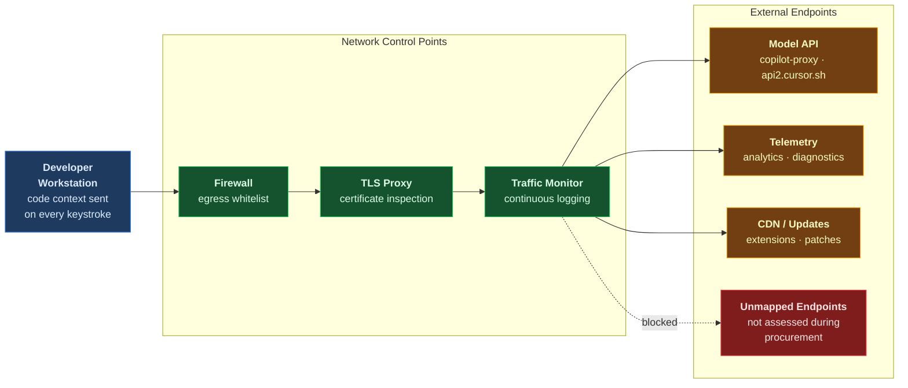

**Series:** AI Security Do's and Don'ts 
**Essay:** Zero Trust for AI (Essay D)

**Author:** Paul Lawlor 
**Date:** 20 February 2026 
**Reading time:** 12 minutes 
**Word count:** ~2,700 
**Abstract:** AI coding tools make continuous outbound API calls carrying code context to external model providers on every keystroke, every chat message, and every agent action. In government networks where data classification and jurisdictional boundaries are mandatory requirements, IDE-level privacy settings alone are insufficient. This essay is the first guide to applying NCSC Zero Trust Architecture principles specifically to AI coding tool deployment. It covers the five most common network security mistakes, six defensive strategies grounded in NCSC guidance, the UK AI Playbook, and vendor documentation, and the organisational changes needed to treat AI tool traffic as a distinct, monitored category on government networks.

**Keywords:** Zero Trust, NCSC, AI coding tools, network security, GitHub Copilot, Cursor, Windsurf, Devin, UK AI Playbook, government networks, egress filtering, data classification, VPC, PrivateLink, DevSecOps

---

## Contents

1. [The network review that changed everything](#the-network-review-that-changed-everything)
2. [How AI tool network traffic works and where trust breaks](#how-ai-tool-network-traffic-works-and-where-trust-breaks)
3. [The don'ts: five common mistakes](#the-donts-five-common-mistakes)
4. [The do's: six defensive strategies](#the-dos-six-defensive-strategies)
5. [The organisational challenge](#the-organisational-challenge)
6. [The path forward](#the-path-forward)
7. [Further reading](#further-reading)
8. [Notes](#notes)

---

## The network review that changed everything

A government department deployed an AI coding tool approved for OFFICIAL data. The team followed every step in the playbook. They configured privacy mode in the IDE. They set data retention to zero. They completed the risk assessment and received sign-off from the Senior Responsible Owner. Developers were onboarded with clear usage guidelines. The tool was popular. Productivity improved. The deployment was held up as a model for other teams to follow.

Three months later, a routine network security review discovered something the team had not anticipated. The AI coding tool had been routing traffic through a US-based CDN endpoint that was not on the department's approved endpoint list. The data in transit included code snippets from a project classified as OFFICIAL-SENSITIVE. The security team confirmed that the IDE was configured correctly. Privacy mode was on. Data retention was set to zero. The tool was behaving exactly as designed.

The problem was at the network level. No firewall rules restricted the tool's outbound connections. No proxy rules routed AI traffic through approved endpoints. Nobody had mapped the full set of external endpoints the tool communicates with. The primary model endpoint had been assessed during procurement, but the telemetry endpoint, the update server, and the CDN node had not. The tool was sending data where it was supposed to send it. The network was not controlling where that data went.

This was not a data breach. There was no malicious actor. It was a configuration gap -- the kind that sits quietly for months until someone looks at the network logs. The team had done the right thing at the application level and missed the network layer entirely.[^1]

This gap is common. Most government teams deploying AI coding tools configure privacy settings in the IDE and consider the security job done. They set data retention policies, enable content filtering, and ensure that code is not used for model training. These are important controls. But they are not sufficient. IDE-level settings control *what* the tool collects and retains. They do not control *where* data travels across the network, *which* endpoints receive it, or *whether* a compromised extension can exfiltrate data through the same network path.[^2]

AI coding tools are fundamentally different from traditional development tools. A linter runs locally. A build tool processes files on the developer's machine. An AI coding tool makes continuous outbound API calls to external model providers -- on every keystroke, every chat message, every agent action. Each request carries code context, file contents, project metadata, and sometimes directory structures and repository URLs.[^3] In government networks where data classification, jurisdictional boundaries, and network segmentation are mandatory requirements, this creates a security challenge that conventional perimeter defences do not address.[^4]

The NCSC Zero Trust Architecture guidance provides the right framework. Its core tenets -- verify explicitly, use least privilege, assume breach -- apply directly to AI coding tool network security.[^5] The UK AI Playbook Principle 3 requires services to comply with Secure by Design principles and be resilient to cyber attacks, which includes network-level security for AI tool data flows.[^6] Yet no publicly available resource applies these principles specifically to the challenge of securing AI coding tool traffic on government networks.

This essay closes that gap. It covers the five most common network security mistakes teams make when deploying AI coding tools, six defensive strategies grounded in NCSC guidance and vendor documentation, and the organisational changes needed to treat AI tool traffic as a distinct, monitored category on your network.

---

## How AI tool network traffic works and where trust breaks

### The data flow

When a developer types code, the AI coding tool assembles a context window -- the current file, nearby files, recent edits, project metadata -- and sends it as an API request to an external model provider endpoint. The model processes the context and returns a suggestion, completion, or chat response. This happens continuously. Every keystroke that triggers an autocomplete suggestion, every chat message, and every agent action generates at least one outbound API call carrying code context.[^7]

For agentic tools operating at Level 3 and above on the Autonomy Ladder described in Essay C, the network footprint expands further. These tools may call MCP servers, execute terminal commands, make additional API requests, and interact with external services -- each generating its own outbound connection.[^8]

The traffic path runs from the developer's workstation, through the corporate network, through any proxies or firewalls, to external endpoints operated by the model provider. GitHub Copilot, for example, communicates with multiple endpoints: `copilot-proxy.githubusercontent.com` for suggestions, `api.github.com` for user management, `copilot-telemetry.githubusercontent.com` for telemetry, and `default.exp-tas.com` for analytics -- among others.[^9] Cursor routes requests through `api2.cursor.sh`, `api3.cursor.sh`, `api5.cursor.sh`, and `repo42.cursor.sh`, with additional endpoints for updates and the extension marketplace.[^10] Metadata accompanies every request: filenames, project names, repository URLs, and language identifiers.

### Where trust breaks

IDE-level privacy settings control what data the tool collects and retains. They cannot control network routing. A tool configured with zero data retention still sends code context across the network to be processed -- it simply instructs the provider not to store it afterwards.

Corporate proxies may not inspect AI tool traffic if custom TLS certificates are not configured. Without certificate installation, encrypted AI tool traffic passes through the proxy as an opaque channel -- visible in volume but invisible in content.[^11]

AI tools communicate with endpoints that may not appear on an organisation's approved list. CDN nodes, telemetry servers, update endpoints, and analytics services often sit outside the primary model endpoint that was assessed during procurement.[^9]

Without egress filtering, a compromised tool or malicious extension sharing the same network context can exfiltrate data to any external endpoint. The same network path used for legitimate AI requests becomes an uncontrolled data channel.[^5]

Government data classification rules require knowing *where* data is processed geographically. Most teams verify the location of the primary model endpoint but do not check the geographic location of telemetry endpoints, CDN nodes, or analytics servers. For OFFICIAL-SENSITIVE data, this is a compliance gap.[^4]

---

## The don'ts: five common mistakes

### Don't 1: Assume IDE-level privacy settings replace network-level controls

Teams configure privacy mode, set data retention to zero, enable suggestion filtering, and consider the security job done. This is the most common gap. IDE-level settings control what the tool *retains*. They do not control what *transits the network*.

A team enables Cursor's privacy mode -- zero data retention, no training on code -- but deploys it on a network with no egress filtering. Privacy mode ensures that Cursor's model providers do not store the code after processing. It does not prevent the code from travelling across an unsegmented network, being routed through an unapproved endpoint, or being intercepted by a compromised extension using the same network path. The data leaves the environment through uncontrolled network channels despite correct IDE configuration.[^10]

This mistake violates two NCSC Zero Trust principles: *know your architecture* and *know your data*. It also falls short of Playbook Principle 3, which requires Secure by Design compliance across the full deployment, not just the application layer.[^5][^6]

### Don't 2: Allow AI tools to reach arbitrary external endpoints without firewall rules

Without firewall rules restricting outbound connections from AI coding tools, the tools can reach any external endpoint -- including endpoints the organisation has not assessed.

GitHub Copilot communicates with multiple domains: `copilot-proxy.githubusercontent.com`, `api.github.com`, telemetry endpoints, analytics services, and wildcard domains such as `*.githubcopilot.com`. Without a whitelist, the tool can also reach any other endpoint. More critically, a compromised extension sharing the same network context can exfiltrate data freely through the same unrestricted path.[^9]

The consequence is a complete loss of visibility. The organisation cannot see where code context is being sent, cannot block data flows to unapproved endpoints, and cannot enforce jurisdictional requirements. This violates the NCSC Zero Trust principles of *protect your services* and *monitor and log*.[^5]

### Don't 3: Skip certificate inspection for AI tool traffic

AI tool traffic is encrypted with TLS. Corporate proxies cannot inspect it unless custom certificates are configured. Many organisations allow AI tool traffic to pass through uninspected because the tool fails certificate pinning checks or because adding exceptions is easier than configuring certificates.

A corporate proxy routes all web traffic through TLS inspection, but the AI coding tool is exempted because it rejects the proxy's certificate. The uninspected traffic channel becomes a blind spot. The organisation has visibility into general web traffic but none into the content of AI tool requests -- the channel most likely to carry sensitive code context.[^11]

This creates an unmonitored data channel that bypasses the organisation's existing inspection infrastructure. It violates the NCSC Cloud Security Principles on data-in-transit protection and the NCSC Zero Trust tenet of *assume breach*.[^12][^5]

### Don't 4: Forget that metadata is also data

Teams focus on protecting code content but ignore the metadata that accompanies every AI tool request. Filenames, project names, repository URLs, directory structures, and language identifiers are sent with each request and can reveal sensitive organisational information.

A developer working on a classified programme uses an AI coding tool. The code content is controlled by privacy mode. But the file path contains the project codename, the repository URL reveals the department and programme name, and the directory structure exposes the architecture of a sensitive system. This metadata travels with every request to the model provider and any intermediate endpoints.[^4]

Under the UK Government Security Classifications framework, OFFICIAL-SENSITIVE information requires handling controls that extend to metadata. Project names, programme identifiers, and organisational structures can constitute sensitive information even when separated from the code itself. Playbook Principle 3 requires that security controls cover the full data flow, not just the payload.[^6][^4]

### Don't 5: Deploy without understanding every endpoint the tool communicates with

Teams approve an AI coding tool based on its primary model provider endpoint. They assess the data processing location, review the vendor's security posture, and confirm classification compliance. But they do not map the full set of endpoints the tool contacts: telemetry servers, update endpoints, CDN nodes, authentication services, and analytics platforms.

A tool is approved because its model endpoint is in an approved UK or EU region. But telemetry data is sent to a US-based analytics endpoint. Extension updates are fetched from a global CDN. Neither endpoint was assessed during procurement. The data classification requirements for OFFICIAL-SENSITIVE data are violated because not all endpoints were assessed for jurisdictional compliance.[^13]

Amazon Q Developer supports AWS PrivateLink and VPC endpoints precisely to address this problem -- keeping traffic on private networks where endpoint destinations are fully controlled.[^13] Without this level of endpoint mapping, the organisation does not have a complete picture of where its data travels. This violates the NCSC Zero Trust principle of *know your architecture*.[^5]

---

## The do's: six defensive strategies

### Do 1: Map every external endpoint your AI tool contacts and whitelist only those

Before any AI coding tool goes live, map every external endpoint it communicates with. This includes the primary model endpoint, authentication endpoints, telemetry endpoints, update servers, CDN nodes, and any MCP server endpoints. Create a whitelist. Block all other egress from developer workstations for AI tool processes. Review and update the whitelist when the tool is updated.

GitHub Copilot documents its required endpoints in detail. The allowlist includes domains for authentication (`github.com/login/*`), suggestions (`copilot-proxy.githubusercontent.com`, `*.githubcopilot.com`), telemetry (`copilot-telemetry.githubusercontent.com`), and analytics (`collector.github.com`). Use this as the starting point for firewall rules and replicate the approach for every AI tool deployed.[^9]

This satisfies the NCSC Zero Trust principle of *know your architecture* and Playbook Principle 3.[^5][^6]

### Do 2: Deploy through VPC or private endpoint configurations where available

For cloud-hosted AI services, use private networking options to keep traffic off the public internet. AWS services support PrivateLink and VPC endpoints for Amazon Q Developer and Bedrock, allowing AI tool traffic to remain on private networks without traversing the public internet.[^13][^14] Azure supports Network Security Perimeter configuration for Azure OpenAI and AI Foundry, enabling private endpoint access with controlled network boundaries.[^15] Devin supports VPC deployment on AWS and Azure with dedicated SaaS and private networking options for high-security environments.[^16]

For government workloads handling OFFICIAL-SENSITIVE data, private endpoints should be the default deployment model, not an optional enhancement. This satisfies the NCSC Zero Trust principle of *protect your services* and the NCSC Cloud Security Principles on data-in-transit protection.[^5][^12]

### Do 3: Configure custom certificates for corporate proxy environments

If your organisation routes traffic through a corporate proxy with TLS inspection, configure the AI coding tool to trust the corporate root certificate. GitHub Copilot supports custom certificate installation through operating system trust stores on Windows, macOS, and Linux.[^11] Cursor and other VS Code-based tools inherit proxy settings and can be configured to trust custom certificate authorities. Without this configuration, the tool will either fail to connect or bypass the proxy entirely -- creating either a usability problem or a security gap.

This satisfies the NCSC Zero Trust tenet of *assume breach* and the principle of *monitor and log*, because inspected traffic can be monitored for anomalous patterns.[^5][^6]

### Do 4: Implement identity verification (SSO with MFA) for every AI tool session

Require single sign-on with multi-factor authentication for all AI coding tool access. GitHub Copilot supports enterprise SSO. Cursor supports SAML and OIDC. Windsurf supports SSO integration with Okta, Azure AD, and Google, along with SCIM provisioning for automated user lifecycle management.[^17] Devin supports SSO with IdP group-based role assignment, ensuring that access to the autonomous agent is controlled through the organisation's existing identity infrastructure.[^16]

Every AI tool session should be authenticated, and session tokens should have time limits. No developer should be able to access an AI coding tool -- and thereby send code context to an external endpoint -- without verified identity. This satisfies the NCSC Zero Trust principles of *know your users and devices* and *verify explicitly*.[^5][^6]

### Do 5: Monitor AI tool network traffic continuously

Do not treat AI tool network security as a one-time deployment task. Monitor AI tool traffic continuously. Set alerts for connections to endpoints not on the approved whitelist. Track data volumes per tool per user. Monitor for unusual patterns: large data transfers outside working hours, connections to new endpoints after tool updates, and traffic spikes that suggest bulk data exfiltration.

Use network monitoring tools already in your environment to add AI tool traffic as a monitored category. AWS Bedrock supports event monitoring through CloudTrail, enabling organisations to track API calls and detect unusual access patterns.[^14] Apply the same approach to all AI coding tool traffic.

This satisfies the NCSC Zero Trust principle of *monitor and log* and Playbook Principle 5, which requires organisations to understand and manage the full AI lifecycle, including ongoing operational monitoring.[^5][^18]

### Do 6: Segment AI tool access by data classification level

Do not use the same AI tool configuration for all data classification levels. Create separate configurations -- or separate tool deployments -- for OFFICIAL and OFFICIAL-SENSITIVE workloads.

OFFICIAL work may use cloud-hosted AI tools with appropriate network controls: endpoint whitelisting, proxy routing, TLS inspection, and continuous monitoring. OFFICIAL-SENSITIVE work should use VPC-deployed or self-hosted options with stricter network controls and private endpoints. Windsurf offers Cloud, Hybrid, and Self-hosted deployment tiers, allowing organisations to match deployment architecture to data sensitivity.[^19] SECRET and TOP SECRET workloads should not use cloud-hosted AI coding tools.[^4]

This satisfies the UK Government Security Classifications requirements, Playbook Principle 3, and Playbook Principle 6, which requires organisations to select the right tool for the job based on the specific requirements of the workload.[^6][^20]

---

## The organisational challenge

### The visibility gap

Most organisations do not have visibility into AI coding tool network traffic as a distinct category. AI tool traffic is mixed with general HTTPS traffic and is not separately monitored or filtered. Without visibility, you cannot enforce classification-appropriate network controls, detect data leakage, or respond to a compromised tool.

The first step is always the same: map the data flows, identify the endpoints, and create a baseline. If your network monitoring dashboard cannot distinguish AI coding tool traffic from general web traffic, you do not have the visibility needed to secure it. The NCSC Zero Trust principles of *know your architecture* and *monitor and log* require this as a foundation.[^5]

### The jurisdiction problem

UK Government Security Classifications require organisations to know where data is processed and stored. For OFFICIAL-SENSITIVE data, processing must remain within approved jurisdictions.[^4] AI coding tool endpoints may be hosted in multiple geographic regions. CDN nodes, telemetry servers, and model endpoints may be in different countries and different legal jurisdictions.

Teams must verify the geographic location of *every* endpoint their AI tool communicates with -- not just the primary model endpoint. A model hosted in the UK is insufficient if telemetry data is routed to a US-based analytics service. The NCSC Cloud Security Principles require organisations to understand where data is stored and processed, including by third-party sub-processors.[^12]

### The configuration drift problem

AI coding tools update frequently. New endpoints are added. Telemetry settings change. Features are enabled by default. A network configuration that was correct at deployment may become insufficient after a tool update adds new external connections or changes the endpoints it communicates with.

Organisations need a process for reviewing network configurations whenever AI tools are updated. This means monitoring vendor changelogs, re-running endpoint mapping after updates, and testing that firewall rules and proxy configurations remain effective. This aligns with the Playbook's emphasis on lifecycle management in Principle 5 and the NCSC Zero Trust principle of *design for change*.[^18][^5]

---

## The path forward

### Why network security matters more for AI tools than traditional software

Traditional development tools operate locally. A linter analyses code on the developer's machine. A build tool compiles files without sending them over the network. An IDE, without AI features, processes code in memory on the workstation. None of these tools make continuous outbound API calls carrying the most sensitive asset in your organisation: your code.

AI coding tools are different. They send code context to external endpoints on every keystroke, every chat interaction, and every agent action. The network is the boundary between your code and the model provider. If that boundary is not controlled, configured, and monitored, IDE-level privacy settings are a false floor. They give the appearance of protection while the network remains open.[^5][^6]

Zero Trust is not an aspirational goal for AI tools in government networks. It is the minimum baseline.

### Three actions to take this week

1. **Map your AI tool endpoints.** For every AI coding tool deployed in your organisation, document every external endpoint it communicates with. Include the primary model endpoint, telemetry, updates, authentication, CDN, and analytics. GitHub Copilot publishes its allowlist; use it as a starting reference.[^9] If you cannot produce a complete endpoint list for a tool, that is your first problem to solve.

2. **Implement egress filtering.** Create firewall rules that whitelist only the approved endpoints for each AI tool. Block all other outbound connections from AI tool processes. Test that the tool works correctly with the restrictions in place. This is the single most impactful network security control for AI coding tools.

3. **Verify jurisdictional compliance.** For each endpoint on your whitelist, confirm the geographic location of the server. Verify that it meets the classification requirements for the data being processed. For OFFICIAL-SENSITIVE data, every endpoint -- not just the model endpoint -- must be in an approved jurisdiction.[^4]

### Looking ahead

AI coding tools are evolving rapidly. New features, new endpoints, and new data flows are introduced with every update. Organisations that build Zero Trust controls now will have a framework that adapts to change. Those that rely on IDE-level settings alone will face repeated surprises as tools evolve and network footprints expand.

The NCSC Zero Trust principles are technology-agnostic by design. They applied to traditional network security. They apply to cloud migration. They apply to AI coding tools today. And they will apply to whatever comes next.[^5]

This essay is the fourth in the AI Security Do's and Don'ts series. Essay A established the governance foundation in the UK AI Playbook. Essay B addressed MCP supply chain security. Essay C introduced the Autonomy Ladder for proportional security controls. This essay has shown what network-level Zero Trust controls look like in practice. Future essays in the series will address prompt injection defence (Essay E) and autonomous agent security (Essay F). Both depend on the network-level controls described here as a foundation.

The message is straightforward. IDE settings control what the tool sends. Network controls determine where it goes. You need both. Start with the network.

---

## Further reading

1. NCSC Zero Trust Architecture Design Principles -- 8 principles for network security
2. NCSC Cloud Security Principles -- 14 principles for evaluating cloud-hosted tools
3. UK AI Playbook for Government (2025) -- Principle 3 (security), Principle 5 (lifecycle)
4. UK Government Security Classifications (GovS 007) -- OFFICIAL, OFFICIAL-SENSITIVE, SECRET, TOP SECRET
5. GitHub Copilot Firewall and Proxy Configuration -- required endpoints and network setup
6. AWS PrivateLink for AI Services -- private networking for Amazon Q and Bedrock
7. Other essays in this series: *The UK AI Playbook* (Essay A), *The MCP Trap* (Essay B), *The Autonomy Ladder* (Essay C)

---

## Notes

[^1]: This scenario is a composite based on common deployment patterns observed in government AI tool rollouts. It is illustrative, not based on a specific incident.

[^2]: NCSC Zero Trust Architecture Design Principles. The Zero Trust model requires that security controls do not rely solely on application-level configuration but extend to network segmentation, egress controls, and continuous monitoring. Available at: https://www.ncsc.gov.uk/collection/zero-trust-architecture

[^3]: GitHub Copilot Firewall and Proxy Configuration. Copilot communicates with multiple endpoints for suggestions, telemetry, analytics, and authentication, each carrying code context and metadata. Available at: https://docs.github.com/en/enterprise-cloud@latest/copilot/managing-copilot/managing-github-copilot-in-your-organization/configuring-your-proxy-server-or-firewall-for-copilot

[^4]: UK Government Security Classifications. The Government Security Classifications Policy defines OFFICIAL, OFFICIAL-SENSITIVE, SECRET, and TOP SECRET handling requirements, including data transmission, processing location, and jurisdictional constraints. Available at: https://www.gov.uk/government/publications/government-security-classifications

[^5]: NCSC Zero Trust Architecture Design Principles. The 8 design principles -- know your architecture, know your users and devices, know your data, assess your risks, protect your services, monitor and log, automate where possible, and design for change -- and the 3 core tenets -- verify explicitly, use least privilege, assume breach -- provide the framework for AI tool network security. Available at: https://www.ncsc.gov.uk/collection/zero-trust-architecture

[^6]: UK AI Playbook for Government (2025). Principle 3 requires that AI services comply with Secure by Design principles and be resilient to cyber attacks. Principle 6 requires selection of the right tool for the job. Available at: https://www.gov.uk/government/publications/ai-playbook-for-the-uk-government/artificial-intelligence-playbook-for-the-uk-government-html

[^7]: Cursor IDE Security Documentation. Cursor makes AI requests on every keystroke for Cursor Tab suggestions, on every chat message, and in the background for context building. Code data is sent to Cursor's infrastructure on AWS and then to model providers. Available at: https://www.cursor.com/security

[^8]: Essay C in this series, *The Autonomy Ladder*, describes the five-level autonomy classification from L1 (autocomplete) to L5 (fully autonomous). Higher-autonomy tools make significantly more network connections including MCP server calls, API requests, and command execution.

[^9]: GitHub Copilot Firewall and Proxy Configuration. The documented allowlist includes endpoints for authentication (`github.com/login/*`), suggestions (`copilot-proxy.githubusercontent.com`, `*.githubcopilot.com`), telemetry (`copilot-telemetry.githubusercontent.com`, `collector.github.com`), and analytics (`default.exp-tas.com`). Available at: https://docs.github.com/en/enterprise-cloud@latest/copilot/managing-copilot/managing-github-copilot-in-your-organization/configuring-your-proxy-server-or-firewall-for-copilot

[^10]: Cursor IDE Security Documentation. Cursor communicates with `api2.cursor.sh`, `api3.cursor.sh`, `api5.cursor.sh`, `repo42.cursor.sh`, and additional endpoints for updates and extensions. Privacy mode ensures zero data retention with model providers but does not control network routing. Available at: https://www.cursor.com/security

[^11]: GitHub Copilot Custom Certificate Installation. Copilot supports custom certificate installation for corporate proxy environments with TLS inspection on Windows, macOS, and Linux. Available at: https://docs.github.com/en/enterprise-cloud@latest/copilot/managing-copilot/configure-personal-settings/configuring-network-settings-for-github-copilot#installing-custom-certificates

[^12]: NCSC Cloud Security Principles. The 14 principles for evaluating cloud-hosted services include data-in-transit protection, asset protection and resilience, and data-at-rest location and jurisdictional considerations. Available at: https://www.ncsc.gov.uk/collection/cloud/the-cloud-security-principles

[^13]: Amazon Q Developer Security Documentation. Amazon Q Developer supports IAM integration, data protection, AWS PrivateLink, and VPC endpoints, allowing AI tool traffic to remain on private networks. Available at: https://docs.aws.amazon.com/amazonq/latest/qdeveloper-ug/security.html

[^14]: AWS Bedrock Security Best Practices. Bedrock provides a baseline architecture with service network accounts, VPC configuration, and event monitoring through CloudTrail. Available at: https://docs.aws.amazon.com/bedrock/latest/userguide/security.html

[^15]: Azure AI Foundry Network Security Perimeter. Azure supports private endpoint configuration for Azure OpenAI and AI Foundry services with network security perimeter controls. Available at: https://learn.microsoft.com/en-us/azure/ai-foundry/openai/how-to/network-security-perimeter

[^16]: Devin AI Enterprise Security Documentation. Devin is SOC 2 Type 2 and ISO/IEC 27001:2022 certified, with VPC deployment options on AWS and Azure, dedicated SaaS with private networking, and SSO with IdP group-based role assignment. Available at: https://docs.devin.ai/enterprise/security/enterprise-security

[^17]: Windsurf Enterprise Admin Guide. Windsurf supports SSO integration with Okta, Azure AD, and Google, SCIM provisioning for automated user lifecycle management, RBAC, service keys with scoped permissions, and feature toggles. Available at: https://university.windsurf.build/windsurf_guide_for_admins

[^18]: UK AI Playbook for Government (2025). Principle 5 requires understanding and managing the full AI lifecycle including setup, day-to-day maintenance, updates, monitoring, and secure closure. Available at: https://www.gov.uk/government/publications/ai-playbook-for-the-uk-government/artificial-intelligence-playbook-for-the-uk-government-html

[^19]: Windsurf IDE Security Documentation. Windsurf (by Codeium) is SOC 2 Type II and FedRAMP High accredited with Cloud, Hybrid, and Self-hosted deployment options, zero data retention by default for enterprise/team, and OWASP ASVS compliance. Available at: https://codeium.com/security

[^20]: UK AI Playbook for Government (2025). Principle 6 states: 'You should select the most appropriate technology to meet your needs' and 'select the most appropriate deployment patterns and choose the most suitable model for your use case.' Available at: https://www.gov.uk/government/publications/ai-playbook-for-the-uk-government/artificial-intelligence-playbook-for-the-uk-government-html
