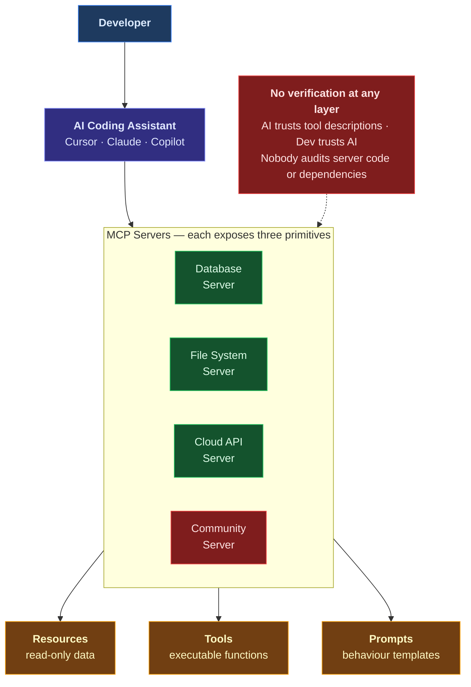

**Series:** AI Security Do's and Don'ts

**Author:** Paul Lawlor 
**Date:** 20 February 2026 
**Reading time:** 11 minutes 
**Word count:** ~2,600 
**Abstract:** The Model Context Protocol (MCP) is the emerging open standard for connecting AI coding assistants to external tools and data sources. It is supported by Cursor, Claude, GitHub Copilot, and a growing ecosystem of AI development tools. MCP servers can read files, query databases, call APIs, and execute code. Most teams install them without security review, treating them like configuration rather than what they are: privileged code running in the development environment. This essay is the first security-focused guide to MCP deployments. It covers the five most common mistakes, six defensive strategies grounded in the UK AI Playbook, NCSC Zero Trust principles, and OWASP guidance, and the organisational changes needed to secure MCP at scale.

**Keywords:** MCP, Model Context Protocol, AI coding tools, supply chain security, Cursor, GitHub Copilot, Claude, NCSC Zero Trust, UK AI Playbook, OWASP, prompt injection, DevSecOps

---

## Contents

1. [The afternoon that opened everything up](#the-afternoon-that-opened-everything-up)
2. [How MCP works and where the trust breaks](#how-mcp-works-and-where-the-trust-breaks)
3. [The don'ts: five common mistakes](#the-donts-five-common-mistakes)
4. [The do's: six defensive strategies](#the-dos-six-defensive-strategies)
5. [The organisational challenge](#the-organisational-challenge)
6. [The path forward](#the-path-forward)
7. [Further reading](#further-reading)
8. [Notes](#notes)

---

## The afternoon that opened everything up

It took one afternoon. A development team configuring their Cursor IDE set up six Model Context Protocol (MCP) servers: one for their PostgreSQL database, one for Jira, one for Confluence, one for Slack, one for their AWS account, and one for browsing the project file system. Each server was installed by adding a short JSON block to a configuration file. No change request. No security review. No approval process. The developers were delighted. They could ask the AI assistant to query the database, check Jira tickets, search Confluence documentation, and browse project files without leaving the editor. Productivity was up. The team lead mentioned it in the sprint retrospective.

A week later, a junior developer found a community MCP server on GitHub that promised richer Slack integration than the one the team was already using. It had over two hundred stars, a clean README, and source code that looked reasonable on a cursory review. The developer installed it by adding a few lines of JSON to their MCP configuration. The whole process took less than five minutes.

Three days later, the security team discovered that the server had been exfiltrating conversation context to an external endpoint. Code snippets containing API keys, database connection strings, and references to internal architecture documents had been sent to a server the team had never heard of. The exfiltration logic was not in the MCP server's own code. It was hidden in a transitive dependency three levels deep: a utility library that the server imported, which itself imported a logging package, which contained the payload.

This is not a sophisticated attack. It is a developer installing a community tool without security review. The same pattern has compromised npm packages, VS Code extensions, and browser plugins for years. The difference is that MCP servers have access to everything the AI assistant can see. In a well-configured development environment, that means files, databases, APIs, and internal documentation. The blast radius of a compromised MCP server is the entire development context.

### Why this matters now

The Model Context Protocol is the emerging open standard for connecting AI coding assistants to external data sources and tools. Published by Anthropic, MCP is described as 'a USB-C port for AI applications': a standardised way to connect AI tools to the systems they need to access.[^1] It is supported by Cursor, Claude Desktop, GitHub Copilot, and a growing ecosystem of AI development tools.[^2] GitHub Copilot's enterprise documentation now includes MCP server management capabilities, recognising that organisations need controls around which servers their developers can use.[^3]

MCP servers can read files, query databases, call APIs, and execute code. They expose three core primitives: **resources** (data the AI can read), **tools** (functions the AI can invoke), and **prompts** (templates that guide AI behaviour).[^4] Each primitive is a potential attack surface.

The UK AI Playbook for Government warns about unverified extensions: 'You must take extreme caution before installing any unverified extensions as these can pose a security risk.'[^5] The Playbook's Principle 3 requires AI services to comply with Secure by Design principles, including for AI-specific threats such as prompt injection and data poisoning.[^6] The OWASP Top 10 for LLM Applications (2025) lists Prompt Injection as LLM01, which includes indirect injection via tool outputs.[^7] MCP tool responses are a direct vector for this attack.

Most teams deploying MCP-connected AI coding tools have no inventory of installed servers, no approval process for new ones, and no monitoring of tool invocations. This essay covers the risks, the common mistakes, and the defensive strategies.

---

## How MCP works and where the trust breaks

### The architecture

MCP follows a client-server model. The AI coding tool -- Cursor, Claude Desktop, GitHub Copilot -- acts as the MCP client. External integrations are MCP servers. When a developer asks the AI assistant a question, the client can invoke MCP tools, read MCP resources, and use MCP prompts to fulfil the request.[^8]

MCP servers expose three primitives. **Resources** are read-only data sources the AI can access: files, database records, API responses. **Tools** are functions the AI can invoke with parameters: run a database query, create a Jira ticket, send a Slack message. **Prompts** are reusable templates that guide AI behaviour for specific tasks.[^9] The AI assistant decides which tools to call and with what parameters, based on the user's query and the tool descriptions provided by the server.

MCP servers run as local processes or remote services. A local server runs on the developer's machine with the same permissions as the host process. A remote server runs elsewhere and communicates over HTTP. In both cases, the server can access anything its host environment can reach: file systems, databases, network services, and cloud APIs.[^10]

### Where the trust breaks

The trust model has three layers, and none of them includes verification. The AI assistant trusts MCP server tool descriptions to be accurate and safe. The developer trusts the AI assistant to use MCP tools appropriately. And nobody verifies that MCP server code does only what it claims to do.[^11]

MCP servers can include hidden functionality in their dependencies. Tool descriptions can contain prompt injection payloads that manipulate the AI's behaviour without the developer's knowledge.[^12] There is no built-in authentication, authorisation, or sandboxing in the base MCP specification for local servers. A single compromised MCP server can access every resource available to the host process.[^13]

The LangChain and LlamaIndex security documentation both emphasise that agent frameworks must validate tool inputs and outputs, and that tools should be treated as untrusted code.[^14] The same principle applies to MCP servers: they are code running in your environment, and they should be treated accordingly.

---

## The don'ts: five common mistakes

### Don't 1: Install community MCP servers without security review

Developers install MCP servers from GitHub repositories with minimal scrutiny, treating them like low-risk browser extensions rather than privileged code. A community MCP server for 'quick Slack integration' with two hundred GitHub stars and clean-looking source code appears safe. But the exfiltration logic is in a transitive dependency three levels deep. It sends conversation context -- including code snippets, API keys, and database connection strings -- to an external endpoint. The developer never sees the malicious code because they only reviewed the top-level repository.

The consequence is data exfiltration at scale: code, credentials, and internal documentation flowing to an attacker-controlled server. The Playbook warns directly: 'You must take extreme caution before installing any unverified extensions as these can pose a security risk.'[^15] Principle 3 requires Secure by Design compliance, which means treating every MCP server as a supply chain dependency that requires security review before installation.[^16]

### Don't 2: Grant MCP servers broad permissions when narrow scopes are available

MCP servers are often configured with far more access than they need. A database MCP server is given a connection string with full read-write access to production data when the development team only needs read access for querying. A file system server is pointed at the repository root when it only needs access to a specific directory.

The consequence is that a compromised or buggy MCP server can modify or delete production data, not just read it. The NCSC Zero Trust Architecture principles are clear: verify explicitly and apply least privilege to every access decision.[^17] The Playbook's Principle 3 reinforces this by requiring services to be secure by design, which includes restricting permissions to the minimum required for each component.[^18]

### Don't 3: Expose MCP servers to resources beyond what the task requires

Some teams configure a single MCP server with access to multiple systems: the database, the file system, cloud storage, and internal APIs, all through one integration. This 'everything server' pattern is convenient but dangerous. Compromising one MCP server gives the attacker access to every connected system. Defence in depth requires separating concerns: one server per integration, each with its own scoped credentials.[^19] The AWS Well-Architected Generative AI Lens reinforces this principle, recommending least privilege access for every component that interacts with AI services.[^20]

### Don't 4: Skip network isolation for MCP servers that access sensitive systems

MCP servers that connect to internal databases or APIs often run on the developer's workstation with unrestricted network access. A database MCP server running locally has direct connectivity to the production database and unrestricted outbound internet access. Nothing prevents a compromised server from sending data to an external endpoint.

The consequence is undetectable data exfiltration. The NCSC Zero Trust principles require organisations to assume breach and segment networks accordingly.[^21] MCP servers that access sensitive systems should run in isolated network segments with firewall rules restricting outbound connections to only the intended endpoints. The Playbook's Principle 3 applies here too: security controls must be proportionate to the sensitivity of the systems being accessed.[^22]

### Don't 5: Assume the AI assistant will only use MCP tools in the way you intended

Teams trust the AI to use MCP tools sensibly, without considering that prompt injection or adversarial inputs can manipulate tool invocation. An attacker crafts a prompt that causes the AI to call the database MCP tool with a destructive query instead of a read operation. Or a malicious document retrieved via RAG contains hidden instructions that direct the AI to invoke MCP tools inappropriately -- the supply chain poisoning vector described in *The RAG Trap* (the RAG security essay in this series) becomes directly relevant when MCP tools are available.[^23]

The consequence is that the AI becomes a proxy for executing arbitrary operations on connected systems. OWASP identifies this as an agent-specific attack pattern: 'Tool Manipulation -- tricking agents into calling tools with attacker-controlled parameters.'[^24] The OWASP Prompt Injection Prevention Cheat Sheet recommends validating tool calls against user permissions and implementing tool-specific parameter validation as core defences.[^25]

---

## The do's: six defensive strategies

### Do 1: Maintain an approved MCP server registry with version pinning and hash verification

Create an organisational registry of approved MCP servers. For each entry, record the server name, source repository, reviewed version, SHA-256 hash of the reviewed version, approved scope (which resources and tools it may access), and the reviewer who approved it. Pin versions explicitly. Do not auto-update. Require a fresh security review for every version change.

This is standard supply chain hygiene applied to a new category of dependency. Use the OpenSSF Scorecard to assess the security posture of each server's repository before approval.[^26] GitHub Copilot's enterprise documentation includes MCP server management capabilities that can support this approach.[^27] This satisfies Playbook Principle 3 (Secure by Design) and Principle 5 (lifecycle management).[^28]

### Do 2: Apply least privilege to every MCP server

Configure each MCP server with the minimum permissions required for its function. Database servers get read-only credentials scoped to specific tables or views. File system servers get access to specific directories, not the entire file system. Cloud servers get IAM roles scoped to specific actions and resources. Rotate credentials regularly. Use short-lived tokens where possible.

This is the NCSC Zero Trust principle of least privilege applied to MCP.[^29] The AWS Well-Architected Generative AI Lens makes the same recommendation under GENSEC01: grant least privilege access to every component that interacts with foundation model endpoints and data stores.[^30] This satisfies Playbook Principle 3.

### Do 3: Implement network segmentation between MCP servers and production systems

MCP servers that connect to sensitive systems should run in isolated network segments. Use firewall rules to restrict outbound connections to only the intended endpoints. Block all other egress. Monitor for connection attempts to unexpected destinations. For high-sensitivity environments, run MCP servers in dedicated containers or virtual machines with explicit network policies that allow traffic only to approved endpoints.

This translates the NCSC Zero Trust principle of 'assume breach' into a practical MCP control.[^31] If a server is compromised, network segmentation limits what the attacker can reach. This satisfies Playbook Principle 3.

### Do 4: Audit MCP tool invocations with structured logging

Log every MCP tool invocation with: timestamp, user identity, tool name, parameters passed, response summary, and the query context that triggered the invocation. Store logs in a tamper-evident system. Set alerts for suspicious patterns: unusual tools being invoked, tools called with unexpected parameters, high-frequency invocations, or invocations outside normal working hours.

LangSmith and similar observability platforms provide tracing and monitoring capabilities for LLM tool invocations that can be adapted for MCP audit logging.[^32] The AWS Well-Architected Generative AI Lens recommends implementing control plane and data access monitoring under GENSEC03.[^33] This satisfies Playbook Principle 5 (lifecycle management and monitoring).

### Do 5: Review MCP server source code and dependencies before deployment

Treat MCP server installation as a code deployment, not a configuration change. Before approving any MCP server: review the source code, audit the full dependency tree including transitive dependencies, scan for secrets and suspicious patterns, and check for obfuscated code or unexpected network calls. Use tools like TruffleHog and Gitleaks to scan for embedded credentials.[^34] Use the OpenSSF Scorecard to assess the security maturity of the server's repository.[^35]

This is the same rigour teams apply to any other third-party code entering their environment. The NCSC Guidelines for Secure AI System Development emphasise the importance of supply chain security and verifying third-party components.[^36] This satisfies Playbook Principle 3 (security review) and supply chain security best practices.

### Do 6: Establish a process for revoking MCP server access when compromised or no longer needed

Define a clear procedure for emergency revocation. When a compromised server is discovered: remove the MCP server configuration from all developer environments, rotate all credentials the server had access to, audit logs for suspicious activity during the exposure window, and notify affected teams. For planned retirement: remove the server from the approved registry, schedule credential rotation, and confirm removal across all environments.

The Playbook's Principle 5 requires organisations to understand 'how to securely close it down at the end of its useful life.'[^37] The OWASP Secure AI/ML Model Ops Cheat Sheet reinforces the need for secrets management and credential rotation as part of the operational security lifecycle.[^38]

---

## The organisational challenge

### The visibility problem

Most organisations have no inventory of MCP servers installed across developer machines. MCP configuration is typically per-developer or per-project, stored in local JSON files that are invisible to central IT. GitHub Copilot's enterprise documentation includes MCP server management capabilities, but most teams are not yet using them.[^39] Without visibility, there is no way to assess supply chain risk, enforce least privilege, or respond to a compromised server. The first step is always the same: know what you have installed.

The Playbook expects organisations to maintain an AI systems inventory that provides 'a comprehensive view of all deployed AI systems within an organisation or programme.'[^40] MCP servers are AI system components. They belong in that inventory.

### The supply chain problem

MCP servers are typically open source projects on GitHub with varying levels of security maturity. Unlike npm packages -- which have audit tools, lock files, and provenance data -- MCP servers have no standardised security metadata, no centralised vulnerability database, and no automated scanning pipeline. There is no equivalent of `npm audit` for MCP servers.

Teams must apply software supply chain security practices manually: code review, dependency auditing, version pinning, and hash verification. The OpenSSF Scorecard can assess the security posture of a server's repository, but the assessment must be done by the team, not by an automated tool in the installation pipeline.[^41] The Playbook expects organisations to understand their supply chain risks (Principle 3) and manage the full lifecycle of their AI deployments (Principle 5).[^42]

### The incident response gap

Most organisations have no procedure for responding to a compromised MCP server. When a compromised server is discovered, the response requires: identifying all environments where the server is installed, revoking all credentials the server had access to, auditing logs for data exfiltration or unauthorised actions during the exposure window, removing the server from all configurations, and rotating all potentially exposed secrets. This is a non-trivial incident response workflow that most teams have not rehearsed.

If you cannot answer the question -- 'which MCP servers are installed on our developers' machines and what can they access?' -- then you have a visibility gap that needs closing before you can respond effectively to a compromise.

---

## The path forward

### Why MCP is different from other integrations

Traditional tool integrations -- Jira plugins, Slack bots, CI/CD pipeline extensions -- are configured by platform teams, reviewed by security, and managed centrally. MCP servers are installed by individual developers, configured in local JSON files, and often invisible to the rest of the organisation.

MCP servers also have access to something other integrations do not: the AI assistant's full context. The code being written. The questions being asked. The files being read. The database queries being run. A compromised MCP server does not just access one system. It accesses the development context itself -- the place where API keys appear in conversation, where architecture decisions are discussed, and where internal documentation is retrieved and summarised.

This is not a theoretical risk. It is the same supply chain pattern that has compromised developer tools repeatedly. The attack surface is the same. The blast radius is larger.

### Three actions to take this week

1. **Inventory your MCP servers.** Ask every developer on your team: which MCP servers do you have installed, where did they come from, and what do they have access to? If you cannot produce this list, that is your first problem. The Playbook expects an AI systems inventory.[^43] MCP servers are part of it.

2. **Implement an approved server list.** Create a minimal registry of reviewed, approved MCP servers with version pinning. Block installation of unapproved servers where your tooling allows it. Start small: even a spreadsheet is better than nothing.

3. **Apply least privilege.** Review the credentials and permissions configured for each MCP server. Reduce every permission to the minimum required. Use read-only access wherever possible. Rotate credentials that have been shared too broadly.

### Looking ahead

MCP is a young protocol. The security tooling will mature. Centralised server registries with security metadata, automated vulnerability scanning, and enterprise management features are all likely to emerge. GitHub Copilot's MCP management features are an early signal of this direction.[^44]

But the fundamental principle will not change: every MCP server you install is code that runs with access to your development environment. Treat it with the same security rigour you apply to any other supply chain dependency.

The Playbook requires compliance with Secure by Design principles (Principle 3), meaningful human control (Principle 4), and full lifecycle management (Principle 5).[^45] All three apply to MCP deployments. Future essays in this series will cover autonomous agent security and prompt injection defences in depth. Both build on the MCP security foundation established here.

### Call to action

MCP servers are not configuration. They are code. Treat them as supply chain dependencies. Apply the same review process to MCP servers that you apply to code deployments. Share this guide with your platform team, security lead, and anyone configuring MCP servers for AI coding tools.

---

## Further reading

1. Model Context Protocol Specification -- protocol architecture, primitives, and security considerations. Available at: [modelcontextprotocol.io](https://modelcontextprotocol.io/)
2. UK AI Playbook for Government (2025) -- Principle 3 (security), Principle 5 (lifecycle management). Available at: [gov.uk](https://www.gov.uk/government/publications/ai-playbook-for-the-uk-government/artificial-intelligence-playbook-for-the-uk-government-html)
3. OWASP Top 10 for LLM Applications (2025) -- LLM01 Prompt Injection. Available at: [genai.owasp.org](https://genai.owasp.org/llm-top-10/)
4. OWASP Prompt Injection Prevention Cheat Sheet -- agent-specific attacks, tool manipulation. Available at: [cheatsheetseries.owasp.org](https://cheatsheetseries.owasp.org/cheatsheets/LLM_Prompt_Injection_Prevention_Cheat_Sheet.html)
5. NCSC Zero Trust Architecture Design Principles -- verify explicitly, least privilege, assume breach. Available at: [ncsc.gov.uk](https://www.ncsc.gov.uk/collection/zero-trust-architecture)
6. GitHub Copilot MCP Documentation -- MCP server management for enterprises. Available at: [docs.github.com](https://docs.github.com/en/copilot/concepts)
7. OpenSSF Scorecard -- evaluating open source dependency security. Available at: [github.com/ossf/scorecard](https://github.com/ossf/scorecard)
8. Other essays in this series: *The UK AI Playbook* (Essay A), *The RAG Trap* (RAG Trap rewrite)

---

## Notes

[^1]: Model Context Protocol, 'What is the Model Context Protocol (MCP)?', Anthropic. MCP is described as 'a USB-C port for AI applications. Just as USB-C provides a standardized way to connect electronic devices, MCP provides a standardized way to connect AI applications to external systems.' Available at: https://modelcontextprotocol.io/

[^2]: Cursor supports MCP server configuration for connecting AI assistants to external tools. See Cursor Security Documentation. Available at: https://www.cursor.com/security. GitHub Copilot supports MCP servers as a public preview feature. See GitHub Copilot Concepts Documentation. Available at: https://docs.github.com/en/copilot/concepts

[^3]: GitHub, 'Piloting GitHub Copilot coding agent in your organization', GitHub Copilot Enterprise Documentation. Covers MCP server management, including iterating on 'access to MCP servers' as part of enterprise rollout. Available at: https://docs.github.com/en/enterprise-cloud@latest/copilot/rolling-out-github-copilot-at-scale/enabling-developers/using-copilot-coding-agent-in-org

[^4]: Model Context Protocol Specification. MCP servers expose three primitives: resources (read-only data sources), tools (functions the AI can invoke), and prompts (reusable templates). Available at: https://modelcontextprotocol.io/

[^5]: UK Government, 'Artificial Intelligence Playbook for the UK Government', Section: Embedded AI applications. Available at: https://www.gov.uk/government/publications/ai-playbook-for-the-uk-government/artificial-intelligence-playbook-for-the-uk-government-html

[^6]: UK Government, AI Playbook, Principle 3: 'When building and deploying AI services, you must make sure that they are secure to use and resilient to cyber attacks... Your service must comply with the Secure by Design principles.' Available at: https://www.gov.uk/government/publications/ai-playbook-for-the-uk-government/artificial-intelligence-playbook-for-the-uk-government-html

[^7]: OWASP, 'Top 10 for Large Language Model Applications (2025)', LLM01: Prompt Injection. Available at: https://genai.owasp.org/llm-top-10/

[^8]: Model Context Protocol Specification, Architecture section. Available at: https://modelcontextprotocol.io/

[^9]: Model Context Protocol Specification, Server Concepts. Available at: https://modelcontextprotocol.io/

[^10]: Model Context Protocol Specification. Local servers run as child processes with the same permissions as the host. Remote servers communicate over HTTP with Streamable HTTP transport. Available at: https://modelcontextprotocol.io/

[^11]: This trust gap is consistent with the broader agent security challenge identified by LangChain: 'tools should be treated as untrusted code.' LangChain Security Best Practices. Available at: https://docs.langchain.com/oss/python/langchain/overview

[^12]: OWASP, 'LLM Prompt Injection Prevention Cheat Sheet', Section: Agent-Specific Attacks. Tool descriptions can serve as a vector for prompt injection payloads. Available at: https://cheatsheetseries.owasp.org/cheatsheets/LLM_Prompt_Injection_Prevention_Cheat_Sheet.html

[^13]: Model Context Protocol Specification. The base specification for local (stdio) transport does not include built-in authentication or sandboxing. Available at: https://modelcontextprotocol.io/

[^14]: LangChain Security Best Practices. Available at: https://docs.langchain.com/oss/python/langchain/overview. LlamaIndex Security Guidelines. Available at: https://docs.llamaindex.ai/en/stable/

[^15]: UK Government, AI Playbook, Section: Embedded AI applications. Available at: https://www.gov.uk/government/publications/ai-playbook-for-the-uk-government/artificial-intelligence-playbook-for-the-uk-government-html

[^16]: UK Government, AI Playbook, Principle 3. Available at: https://www.gov.uk/government/publications/ai-playbook-for-the-uk-government/artificial-intelligence-playbook-for-the-uk-government-html

[^17]: NCSC, 'Zero Trust Architecture Design Principles'. Eight principles for implementing zero trust, including verify explicitly and apply least privilege. Available at: https://www.ncsc.gov.uk/collection/zero-trust-architecture

[^18]: UK Government, AI Playbook, Principle 3. Available at: https://www.gov.uk/government/publications/ai-playbook-for-the-uk-government/artificial-intelligence-playbook-for-the-uk-government-html

[^19]: Defence in depth and separation of concerns are foundational security principles reinforced by the NCSC Guidelines for Secure AI System Development. Available at: https://www.ncsc.gov.uk/files/Guidelines-for-secure-AI-system-development.pdf

[^20]: AWS, 'Generative AI Lens -- Well-Architected Framework', Security pillar, GENSEC01: 'Grant least privilege access to foundation model endpoints.' Available at: https://docs.aws.amazon.com/wellarchitected/latest/generative-ai-lens/security.html

[^21]: NCSC, 'Zero Trust Architecture Design Principles'. The 'assume breach' principle requires segmenting networks to limit blast radius. Available at: https://www.ncsc.gov.uk/collection/zero-trust-architecture

[^22]: UK Government, AI Playbook, Principle 3. Available at: https://www.gov.uk/government/publications/ai-playbook-for-the-uk-government/artificial-intelligence-playbook-for-the-uk-government-html

[^23]: The RAG poisoning vector is covered in detail in *The RAG Trap: Do's and Don'ts for Securing AI Coding Assistants That Learn from Your Documentation* (RAG Trap rewrite essay in this series). MCP tools connected to RAG-enhanced assistants inherit the poisoning risk.

[^24]: OWASP, 'LLM Prompt Injection Prevention Cheat Sheet', Section: Agent-Specific Attacks. 'Tool Manipulation: Tricking agents into calling tools with attacker-controlled parameters.' Available at: https://cheatsheetseries.owasp.org/cheatsheets/LLM_Prompt_Injection_Prevention_Cheat_Sheet.html

[^25]: OWASP, 'LLM Prompt Injection Prevention Cheat Sheet', Section: Agent-Specific Defenses. 'Validate tool calls against user permissions and session context. Implement tool-specific parameter validation.' Available at: https://cheatsheetseries.owasp.org/cheatsheets/LLM_Prompt_Injection_Prevention_Cheat_Sheet.html

[^26]: OpenSSF Scorecard. Automated security checks for open source projects, including branch protection, dependency updates, and vulnerability disclosure. Available at: https://github.com/ossf/scorecard

[^27]: GitHub, 'Piloting GitHub Copilot coding agent in your organization'. Covers iterating on 'access to MCP servers' as part of enterprise configuration. Available at: https://docs.github.com/en/enterprise-cloud@latest/copilot/rolling-out-github-copilot-at-scale/enabling-developers/using-copilot-coding-agent-in-org

[^28]: UK Government, AI Playbook, Principle 3 and Principle 5. Available at: https://www.gov.uk/government/publications/ai-playbook-for-the-uk-government/artificial-intelligence-playbook-for-the-uk-government-html

[^29]: NCSC, 'Zero Trust Architecture Design Principles'. Available at: https://www.ncsc.gov.uk/collection/zero-trust-architecture

[^30]: AWS, 'Generative AI Lens -- Well-Architected Framework', GENSEC01-BP01: 'Grant least privilege access to foundation model endpoints', GENSEC01-BP03: 'Implement least privilege access permissions for foundation models accessing data stores.' Available at: https://docs.aws.amazon.com/wellarchitected/latest/generative-ai-lens/security.html

[^31]: NCSC, 'Zero Trust Architecture Design Principles'. Available at: https://www.ncsc.gov.uk/collection/zero-trust-architecture

[^32]: LangSmith Observability. Tracing and monitoring for LLM pipelines, including tool invocation logging. Available at: https://docs.smith.langchain.com/

[^33]: AWS, 'Generative AI Lens -- Well-Architected Framework', GENSEC03-BP01: 'Implement control plane and data access monitoring to generative AI services and foundation models.' Available at: https://docs.aws.amazon.com/wellarchitected/latest/generative-ai-lens/security.html

[^34]: TruffleHog. Secrets scanning for git repositories, filesystems, and S3 buckets. Available at: https://github.com/trufflesecurity/trufflehog. Gitleaks. Secrets detection for git repositories. Available at: https://gitleaks.io/

[^35]: OpenSSF Scorecard. Available at: https://github.com/ossf/scorecard

[^36]: NCSC, 'Guidelines for Secure AI System Development'. Section on supply chain security: 'Verify any third-party inputs are from sources you trust.' Available at: https://www.ncsc.gov.uk/files/Guidelines-for-secure-AI-system-development.pdf

[^37]: UK Government, AI Playbook, Principle 5: 'You should know how to... securely close it down at the end of its useful life.' Available at: https://www.gov.uk/government/publications/ai-playbook-for-the-uk-government/artificial-intelligence-playbook-for-the-uk-government-html

[^38]: OWASP, 'Secure AI/ML Model Ops Cheat Sheet'. Covers secrets management and credential rotation for AI/ML operations. Available at: https://cheatsheetseries.owasp.org/cheatsheets/Secure_AI_Model_Ops_Cheat_Sheet.html

[^39]: GitHub Copilot Enterprise Documentation. MCP servers are configurable at the organisation level, but most teams have not yet implemented centralised MCP management. Available at: https://docs.github.com/en/copilot/concepts

[^40]: UK Government, AI Playbook, Section: Creating an AI systems inventory. 'To provide a comprehensive view of all deployed AI systems within an organisation or programme, organisations should set up an AI and machine learning (ML) systems inventory.' Available at: https://www.gov.uk/government/publications/ai-playbook-for-the-uk-government/artificial-intelligence-playbook-for-the-uk-government-html

[^41]: OpenSSF Scorecard. Available at: https://github.com/ossf/scorecard

[^42]: UK Government, AI Playbook, Principle 3 and Principle 5. Available at: https://www.gov.uk/government/publications/ai-playbook-for-the-uk-government/artificial-intelligence-playbook-for-the-uk-government-html

[^43]: UK Government, AI Playbook, Section: Creating an AI systems inventory. Available at: https://www.gov.uk/government/publications/ai-playbook-for-the-uk-government/artificial-intelligence-playbook-for-the-uk-government-html

[^44]: GitHub Copilot Enterprise Documentation. Available at: https://docs.github.com/en/copilot/concepts

[^45]: UK Government, AI Playbook, Principles 3, 4, and 5. Available at: https://www.gov.uk/government/publications/ai-playbook-for-the-uk-government/artificial-intelligence-playbook-for-the-uk-government-html
