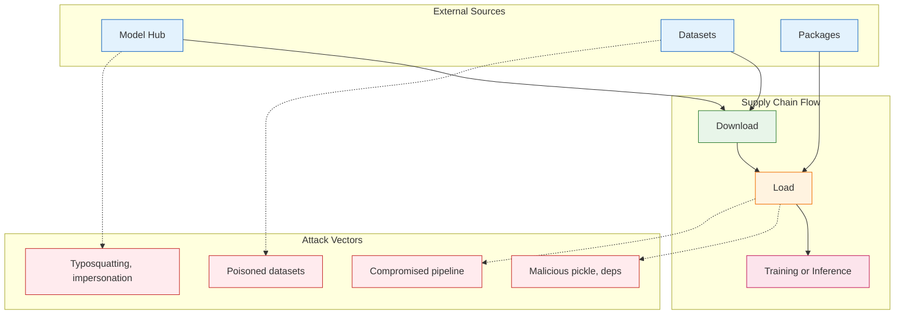
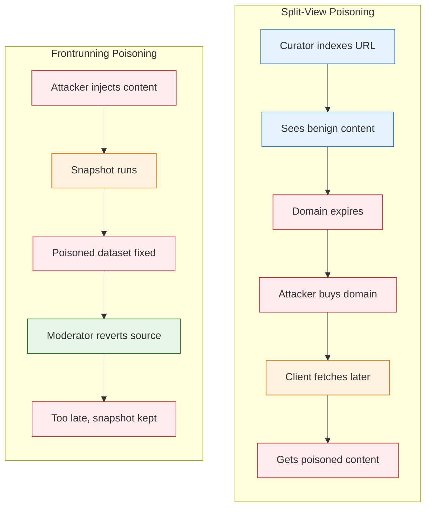

**Series:** AI Security in Practice<br/>
**Pillar:** 6: Emerging Threats and Research<br/>
**Difficulty:** Intermediate<br/>
**Author:** Paul Lawlor<br/>
**Date:** 2 March 2026<br/>
**Reading time:** 12 minutes

> Analysis of AI supply chain attack vectors from model hubs and datasets to production, with practical defensive measures for scanning, provenance verification, and secure dependency management.

---

## Table of Contents

1. [The Landscape](#1-the-landscape)
2. [Threat Model](#2-threat-model)
3. [Technical Deep Dive](#3-technical-deep-dive)
4. [Case Studies](#4-case-studies)
5. [Patterns and Trends](#5-patterns-and-trends)
6. [Defensive Recommendations](#6-defensive-recommendations)
7. [Open Questions](#7-open-questions)
8. [Summary and Outlook](#8-summary-and-outlook)

---

## 1. The Landscape

The AI supply chain is a new attack surface. Unlike traditional software, where you compile dependencies from package registries and run them in a controlled environment, the AI supply chain spans model hubs, datasets, training pipelines, and runtime frameworks. A single compromised link can propagate to every system that consumes it.

**Hugging Face** hosts hundreds of thousands of models, tens of thousands of datasets, and Spaces (hosted applications). It has become the de facto distribution channel for open-source AI.[^1] Researchers pull models with `from_pretrained()`, fine-tune on public datasets, and deploy to production. The convenience is undeniable. The risk is that trust is often assumed rather than verified. A model named `bert-base-uncased-finetuned` might be the canonical BERT fine-tune, or it might be a typosquatted impostor. A dataset with millions of URLs might include poisoned samples that manipulate model behaviour. A pickle-serialised model file might execute arbitrary code the moment it loads.

OWASP classifies this under **ML06:2023 AI Supply Chain Attacks**.[^2] The category covers model hubs, MLOps platforms, data management systems, and specialised ML software. The UK government's AI Playbook notes that "the current tooling for doing this with open source AI models is much more limited" than for traditional software supply chains, and that Hugging Face malware scanning "is not capable of determining if a given AI model has been trained on poisoned data."[^3]

The supply chain extends beyond Hugging Face. Training datasets such as LAION, COYO, and Common Crawl consist of indices of URLs that clients fetch at different times. The content behind those URLs can change. Carlini et al. demonstrated that an attacker could poison 0.01% of LAION-400M or COYO-700M for approximately $60 USD by purchasing expired domains that hosted images in the dataset.[^4] That fraction is sufficient to introduce targeted misclassification or backdoors in models trained on the poisoned data.[^5]

The landscape is characterised by three properties: **distribution at scale** (models and datasets are too large to manually audit), **mutable content** (URLs and snapshots change over time), and **legacy formats** (Python pickle, the default for PyTorch, allows arbitrary code execution on load).[^6] Each property widens the attack surface. Understanding them is the first step toward defence.

---

## 2. Threat Model

An AI supply chain attack has four components: the **adversary**, the **target**, the **attack vector**, and the **payload**.

**Adversary.** The adversary may be a low-resource individual (domain purchase, typosquatting), a well-resourced actor (compromising CI/CD, maintaining malicious packages), or an insider. They need not have direct access to the victim's infrastructure. They need only to influence a component that the victim consumes: a model, a dataset, a dependency, or a pipeline configuration.

**Target.** The target is any organisation that trains models on external data, downloads models from public hubs, or depends on ML frameworks and packages. Fine-tuning workflows are particularly exposed: they combine pre-trained weights (from a hub) with datasets (often public) and training code (with dependencies). Each dependency is a potential compromise point.

**Attack vectors.** Six primary vectors matter in practice:

1. **Model typosquatting.** An attacker publishes a model with a name similar to a popular model (e.g., `bert-base-uncased` vs. `bert-base-uncased-finetuned-malicious`). Users who mistype or copy from untrusted documentation download the wrong model. OWASP Scenario #3 describes an attacker who impersonates an organisation and deploys a malicious model; employees then download it and execute the payload.[^7]

2. **Poisoned datasets.** Data contamination in public training sets. Carlini et al. distinguish **split-view poisoning** (the content at a URL changes between when the dataset curator indexed it and when a client downloads it) and **frontrunning poisoning** (timing malicious edits just before a snapshot, as with Wikipedia).[^4] Prior work shows poisoning rates as low as 0.001% can introduce backdoors or targeted misclassification.[^5]

3. **Malicious model files.** Pickle-serialised models can contain arbitrary Python code. When `torch.load()` or `pickle.load()` runs, that code executes in the loader's context: full filesystem access, network access, credential theft.[^8] Hugging Face documents this explicitly: "There are dangerous arbitrary code execution attacks that can be perpetrated when you load a pickle file."[^6]

4. **Compromised dependencies.** ML projects depend on `transformers`, `torch`, `datasets`, and dozens of other packages. A compromised package (e.g., via typosquatted PyPI package, or a takeover of a legitimate package) can exfiltrate data, alter model outputs, or provide a foothold in the build environment. This mirrors traditional supply chain attacks (e.g., SolarWinds, npm compromises) but with ML-specific impact.[^2]

5. **Compromised training pipelines.** CI/CD systems that train or fine-tune models may pull models and datasets from external sources. If the pipeline is compromised (e.g., via a vulnerable MLOps platform, exposed API, or poisoned runner), an attacker can inject malicious artifacts into the build.

6. **Compromised model hubs.** An attacker who gains access to a hub account (phishing, credential theft) can replace a trusted model with a malicious one, or add malicious models under a trusted organisation's name.

**Payload.** The payload may be: credential theft (cloud keys, API tokens), data exfiltration (training data, inference inputs), model poisoning (backdoors, biased outputs), or persistent access (reverse shells, backdoors in deployed systems). The choice depends on the adversary's goals and the compromise point.



---

## 3. Technical Deep Dive

### 3.1 Pickle and Model Serialisation

PyTorch uses Python pickle as the default format for `torch.save()` and `torch.load()`. Pickle serialises an object graph by encoding it as a sequence of opcodes. When unpickling, the interpreter executes those opcodes. Certain opcodes (e.g., `GLOBAL`, `REDUCE`) cause the unpickler to import and invoke arbitrary functions. A malicious pickle can call `exec()` or `eval()` with attacker-controlled strings, achieving arbitrary code execution the moment the file is loaded.[^6]

Tools such as **Fickling** (Trail of Bits) allow crafting malicious pickles. ModelScan, from Protect AI, scans model files without loading them by analysing file contents for unsafe code patterns and flagging dangerous operations such as arbitrary file read or write. Hugging Face runs Pickle Import scans on uploads and displays the list of imports referenced in each pickled file. Suspicious imports are highlighted. This is a best-effort defence: it is not foolproof, and the safe/unsafe import lists are maintained manually.[^6]

The alternative is **safetensors**, a format that stores tensors without executable code. Loading a safetensors file does not execute arbitrary logic. Hugging Face recommends safetensors for model weights and supports it in the `transformers` library. Many popular models now provide both pickle and safetensors variants; prefer safetensors when available.[^9]

### 3.2 Data Poisoning at Web Scale

Carlini et al. introduced two attacks that guarantee malicious examples appear in web-scale datasets.[^4]

**Split-view poisoning.** Distributed datasets (e.g., LAION-400M) publish an index of `(url, caption)` tuples. The maintainer does not distribute the actual images; clients fetch them when downloading the dataset. The content at a URL when the maintainer indexed it may differ from the content when a client fetches it later. If an attacker gains control of the domain (e.g., by purchasing it after it expires), they can serve arbitrary images. The client receives poisoned data. The attack cost is low: domains expire regularly, and the researchers found that 0.01% of LAION-400M could be poisoned for approximately $60 USD by purchasing expired domains that hosted multiple dataset images.[^4]

**Frontrunning poisoning.** Centralised datasets (e.g., Wikipedia snapshots) periodically capture content from URLs at a fixed time. If an attacker can predict the capture schedule and inject malicious content just before the snapshot, the poisoned content is baked into the dataset. Even if moderators revert the malicious edit afterwards, the snapshot remains poisoned. Wikipedia's snapshot procedure accesses articles in a predictable linear sequence, making timing predictable to the minute.[^4]



Defences proposed by the researchers: **integrity verification** (cryptographic hashes for all content so clients detect mismatch) and **timing-based defences** (randomise snapshot order, delay inclusion to allow moderator review). Six of the ten datasets they studied adopted integrity checks after disclosure.[^4]

### 3.3 Hugging Face Security Controls

The Hub provides several security features: private repositories, access tokens, 2FA, commit signing (GPG), malware scanning (ClamAV), pickle import scanning, and optional third-party scanners (Protect AI, JFrog).[^1] Malware scanning runs at each commit; infected files are flagged. Pickle scanning extracts imports without executing code. However, ClamAV does not detect model poisoning or pickle-based exploits that use only "benign" imports in creative ways.[^3] The Hub cannot verify that a model was trained on unpoisoned data.

For production use, the recommendation is to prefer safetensors, load only from trusted sources, and run local scanning (e.g., ModelScan) before loading any model in a sensitive environment.[^8]

---

## 4. Case Studies

**Case 1: Pickle-based credential theft.** Protect AI's ModelScan documentation describes a model that contains unsafe operators for `ReadFile` and `WriteFile`. When loaded, the model could read AWS credentials from the filesystem and exfiltrate them to an attacker-controlled endpoint.[^8] The attack requires no user interaction beyond loading the model. A team that downloads a "helpful" fine-tuned model from an unfamiliar author and runs `torch.load()` in a production environment with cloud credentials would be compromised.

**Case 2: Dataset poisoning via expired domains.** Carlini et al. purchased expired domains that hosted images in LAION-400M and COYO-700M. They set up servers to log requests and measured download rates: approximately 15 million requests per month across the datasets they monitored, with regular downloads of LAION, COYO, and others. An attacker could have served poisoned images (e.g., mislabelled or backdoor-triggering) to every researcher who downloaded the dataset after the domain purchase. Poisoning 0.01% of the data is sufficient for targeted misclassification in prior work; the cost to achieve that was under $60.[^4]

**Case 3: Model hub impersonation.** OWASP's ML06 Scenario #3 describes an attacker who impersonates an organisation's account on a model hub and uploads a malicious model. Employees of the organisation download the model, believing it to be from a trusted source. The malicious code runs in the organisation's environment. This scenario emphasises the importance of verifying model provenance (signed commits, known authors) and scanning before use.[^7]

**Case 4: Dependency compromise.** The OWASP ML06 Scenario #1 describes an attacker who modifies an open-source package (e.g., NumPy or Scikit-learn) and uploads it to a public repository. When the victim installs the package, malicious code is installed. This is the classic software supply chain attack applied to ML. Tools such as Dependabot and Snyk help track vulnerabilities in dependencies, but a malicious package that has not yet been flagged can slip through.[^2]

**Case 5: Malware in a Hugging Face model.** Malicious models that exploit pickle deserialisation to steal credentials or execute arbitrary code have been demonstrated in research and have appeared on public hubs.[^6] Hugging Face's Pickle Import scan and ClamAV malware scan aim to catch such artifacts, but novel techniques or polymorphic payloads may evade detection. Defence in depth requires local scanning (ModelScan) and avoiding pickle when alternatives exist.[^8]

---

## 5. Patterns and Trends

**Pattern: Quantity over verification.** The scale of public model hubs (hundreds of thousands of models) makes manual review infeasible. Download counts and "likes" provide weak signals of trust. Organisations that prioritise speed over verification (e.g., pulling the first search result for a model name) increase exposure. The trend is toward more models, more datasets, and more automation, which expands the attack surface without a proportional increase in verification tooling.

**Pattern: Dataset immutability is assumed but not guaranteed.** Many practitioners treat published dataset indices as immutable. Carlini et al. showed that for distributed datasets, the content at each URL can change after publication. For centralised datasets (e.g., Wikipedia snapshots), content is fixed at snapshot time but can be poisoned by frontrunning. Few datasets implement integrity verification; those that do often lack downloaders that enforce it.[^4]

**Pattern: Pickle remains dominant despite known risks.** PyTorch's default serialisation is pickle. The ML community has adopted safetensors for many new models, but legacy models and many fine-tuned variants are still distributed as pickle. Migration is gradual. Meanwhile, tools such as ModelScan and Fickling help defenders scan without loading, but adoption is uneven.

**Trend: Fine-tuning amplifies supply chain exposure.** Teams that fine-tune foundation models combine: (1) base weights from a hub, (2) datasets (often public or crawled), and (3) training code with dependencies. Each component is a potential compromise point. A poisoned dataset can backdoor the fine-tuned model even if the base model is clean. A compromised dependency can exfiltrate training data.

**Trend: AI-specific supply chain tooling is emerging.** ModelScan, Fickling, Hugging Face's built-in scans, and third-party scanners (Protect AI Guardian, JFrog) are improving. The UK government notes that "tooling for doing this with open source AI models is much more limited" than for traditional software.[^3] The gap is narrowing but remains significant. SBOMs and dependency tracking for ML artifacts (AIBOM) are early-stage.

**Trend: Integrity verification for datasets is gaining traction.** Following Carlini et al.'s disclosure, six of the ten studied datasets adopted integrity checks. The patch was provided to a popular web-scale dataset downloader. This is positive progress but does not cover all datasets, and enforcement depends on clients actually verifying hashes.[^4]

---

## 6. Defensive Recommendations

### 6.1 Model Verification

**Prefer safetensors over pickle.** When a model provides both formats, use safetensors. Load with `from_pretrained(..., use_safetensors=True)` or equivalent. Safetensors does not execute code; it only reads tensor data.[^9]

**Scan before load.** Run **ModelScan** on every model file before loading in any environment with credentials or sensitive data:

```bash
pip install modelscan
modelscan -p /path/to/model_file.pkl
```

For TensorFlow or H5 models, install with extras: `pip install 'modelscan[tensorflow,h5py]'`. Integrate ModelScan into CI/CD so that models are scanned before they enter training or deployment pipelines.[^8]

**Verify provenance.** Prefer models from organisations and authors you trust. On Hugging Face, check for signed commits (GPG). Use explicit, version-pinned model identifiers (e.g., `organization/model-name@revision`) rather than mutable tags. Maintain an internal allowlist of approved models for production use.

**Load TensorFlow or Flax variants when possible.** If a model is available in TensorFlow or Flax format, loading with `from_tf=True` or `from_flax=True` bypasses pickle for the weights. This applies to models that provide cross-framework checkpoints.[^6]

### 6.2 Dataset Verification

**Verify integrity when available.** If a dataset publishes cryptographic hashes for its content, use a downloader that verifies them. Carlini et al. provided patches to support integrity checks in a popular downloader; check whether your dataset and tooling support this.[^4]

**Treat dataset sources as untrusted.** When using web-scraped or public datasets, assume a fraction may be poisoned. For high-stakes applications, consider: (1) using datasets with integrity verification, (2) auditing a sample of data before training, (3) applying data sanitisation or outlier detection. Be aware that sophisticated poisoning can be hard to detect.

**Prefer static datasets over URL indices when feasible.** Datasets that distribute content directly (rather than URLs to fetch) avoid split-view poisoning. When URLs are necessary, prefer datasets that include content hashes.

### 6.3 Dependency and Pipeline Security

**Pin and verify package versions.** Use `requirements.txt` or `pyproject.toml` with exact version pins. Run Dependabot, Snyk, or similar tools to track vulnerabilities. Before adding a new dependency, verify it comes from a reputable source (official PyPI, trusted maintainers).

**Secure MLOps and CI/CD.** Restrict access to training pipelines. Do not expose model hubs or inference platforms to the public internet without authentication.[^2] Use private model registries for internal models. Scan artifacts at pipeline stages: before training (inputs), after training (outputs), before deployment.

**Principle of least privilege.** Run model loading and training in environments with minimal permissions. Isolate credential access. Use separate service accounts for different pipeline stages.

### 6.4 Organisational Controls

**Maintain an approved model list.** For production, restrict downloads to a curated set of models. New model requests go through a review process that includes scanning and provenance verification.

**Train staff on supply chain risks.** Ensure ML engineers and data scientists understand: the risk of pickle, the value of scanning, and the importance of verifying model and dataset sources. Include AI supply chain in security awareness training.

**Define incident response for compromised artifacts.** Have procedures for: isolating affected systems, identifying the compromise source, removing malicious artifacts, and notifying stakeholders. Consider how to handle a poisoned model that has already been fine-tuned and deployed.

---

## 7. Open Questions

**Detection of data poisoning.** Malware scanning and pickle import analysis can catch malicious code in model files. Detecting that a model was trained on poisoned data is harder. Model behaviour may be subtly altered (e.g., a backdoor that triggers on a specific input pattern) without obvious indicators. Research on poisoning detection and model sanitisation is ongoing but not yet practical at scale.

**Integrity verification adoption.** Carlini et al. showed that integrity checks mitigate split-view poisoning, and several datasets have adopted them. But many datasets and downloaders still do not enforce verification. The question is whether the ecosystem will converge on integrity-by-default or whether partial adoption will leave significant gaps.

**Safetensors migration.** Safetensors is the preferred format for new models, but pickle remains pervasive. PyTorch has discussed a safe loading mode for pickle files; progress is slow. The timeline for deprecating unsafe pickle for model weights is unclear.

**AIBOM and SBOM for ML.** Software Bill of Materials (SBOM) is gaining traction for traditional software. An AI Bill of Materials (AIBOM) would document model provenance, training data sources, and dependencies. Standards and tooling are emerging (e.g., NTIA work on SBOM) but ML-specific extensions are immature. How will organisations track and attest to the full lineage of a production model?

**Attribution and response.** When a malicious model is discovered, who is responsible for removal and notification? Model hubs can delete artifacts, but copies may already be distributed. Dataset maintainers can publish advisories, but clients who downloaded earlier may be unaware. Incident response for AI supply chain compromises lacks established playbooks.

---

## 8. Summary and Outlook

The AI supply chain introduces attack vectors that traditional software supply chain security does not fully address. Model typosquatting, poisoned datasets, malicious pickle files, compromised dependencies, and vulnerable pipelines each create opportunities for adversaries to compromise systems that consume external AI artifacts. The barrier to entry is low: Carlini et al. demonstrated dataset poisoning for under $60; crafting a malicious pickle requires only basic tooling.

Defence requires a layered approach. Prefer safetensors over pickle. Scan every model with ModelScan before loading in sensitive environments. Verify dataset integrity when available. Pin dependencies and monitor for vulnerabilities. Restrict production models to an approved list. Treat the AI supply chain as untrusted until verified.

The outlook is mixed. Tooling is improving: ModelScan, Hugging Face's scans, and integrity verification for datasets are steps in the right direction. But adoption is uneven, and several attack vectors (especially data poisoning detection) lack robust solutions. As fine-tuning and open model usage grow, supply chain hygiene must become standard practice for any team deploying AI to production.

**Actions this week:** (1) Audit which models and datasets your team uses and whether they are scanned; (2) Install ModelScan and run it on the next model you download; (3) Check if your preferred models offer safetensors and switch where possible.

---

[^1]: Hugging Face Hub Security. https://huggingface.co/docs/hub/security

[^2]: OWASP Machine Learning Security Top 10, ML06:2023 AI Supply Chain Attacks. https://owasp.org/www-project-machine-learning-security-top-10/docs/ML06_2023-AI_Supply_Chain_Attacks.html

[^3]: UK Government AI Playbook, Supply Chain and Open Source AI. https://www.gov.uk/guidance/ai-playbook

[^4]: Carlini, N., Jagielski, M., Choquette-Choo, C.A., Paleka, D., Pearce, W., Anderson, H., Terzis, A., Thomas, K., and Tramer, F. "Poisoning Web-Scale Training Datasets is Practical." arXiv:2302.10149, 2024. https://arxiv.org/abs/2302.10149

[^5]: Carlini et al. (2024), Section 2, cite prior work showing that poisoning rates as low as 0.001% can introduce backdoors or targeted misclassification. https://arxiv.org/abs/2302.10149

[^6]: Hugging Face Pickle Security. https://huggingface.co/docs/hub/security-pickle

[^7]: OWASP ML06 Scenario #3: Attack on ML model hub. https://owasp.org/www-project-machine-learning-security-top-10/docs/ML06_2023-AI_Supply_Chain_Attacks.html

[^8]: Protect AI ModelScan: Protection Against Model Serialisation Attacks. https://github.com/protectai/modelscan

[^9]: Hugging Face Safetensors. https://huggingface.co/docs/safetensors
