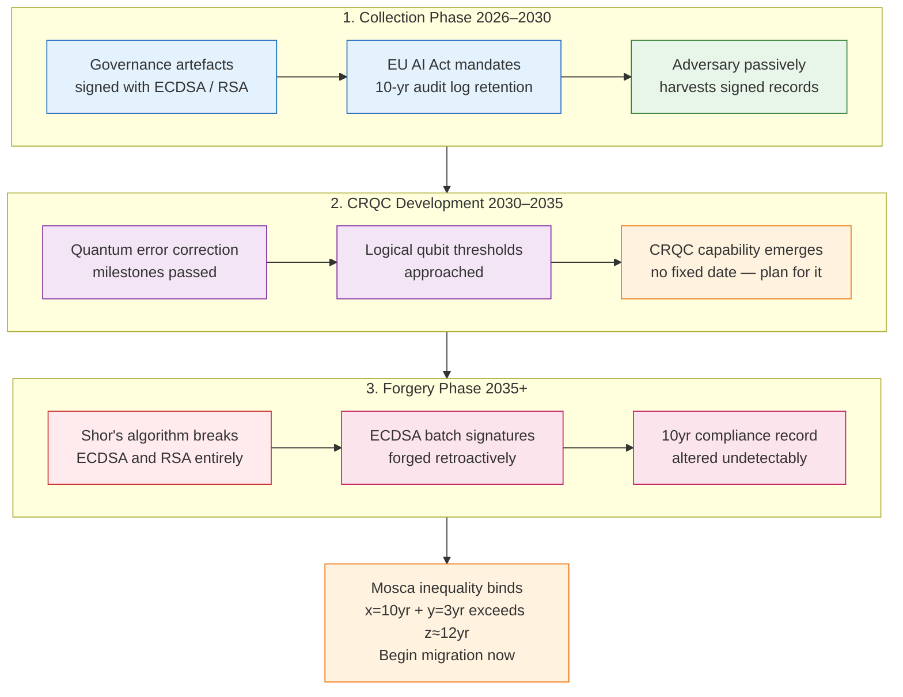
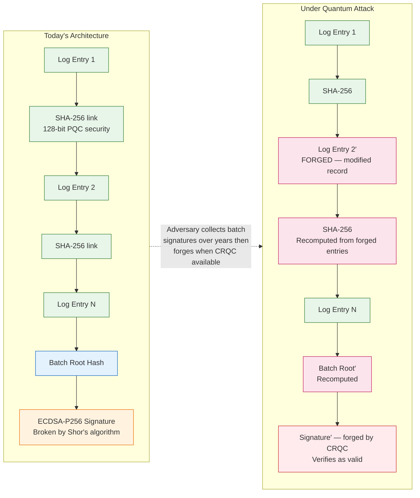
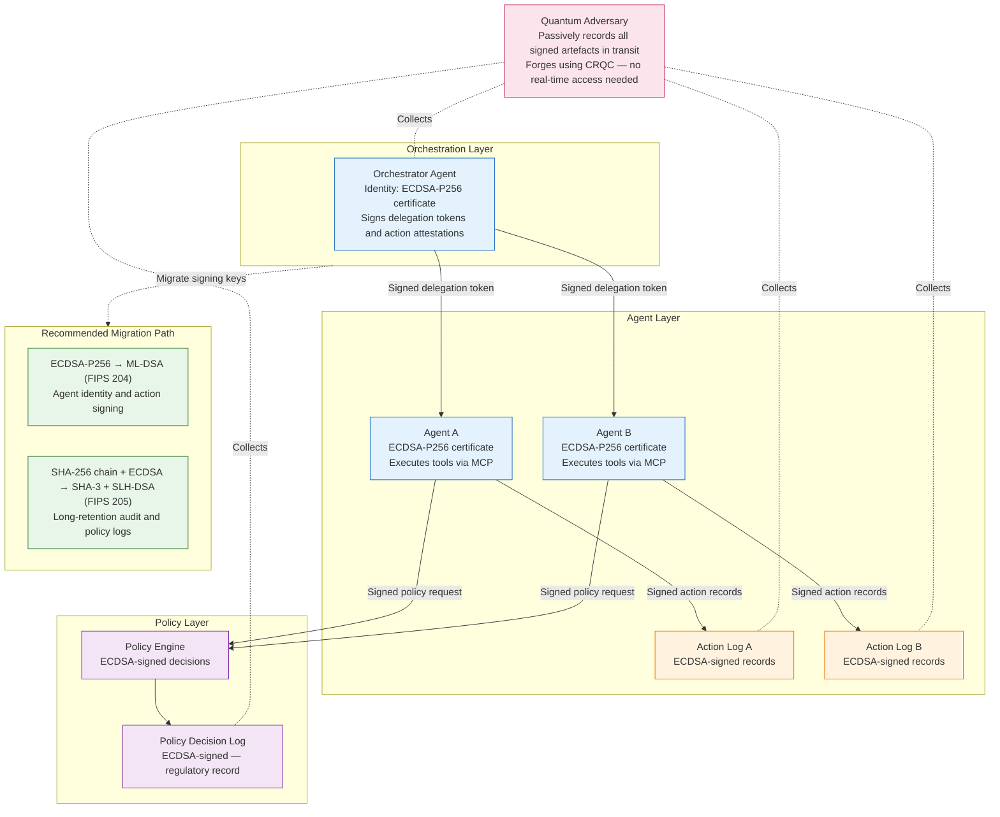
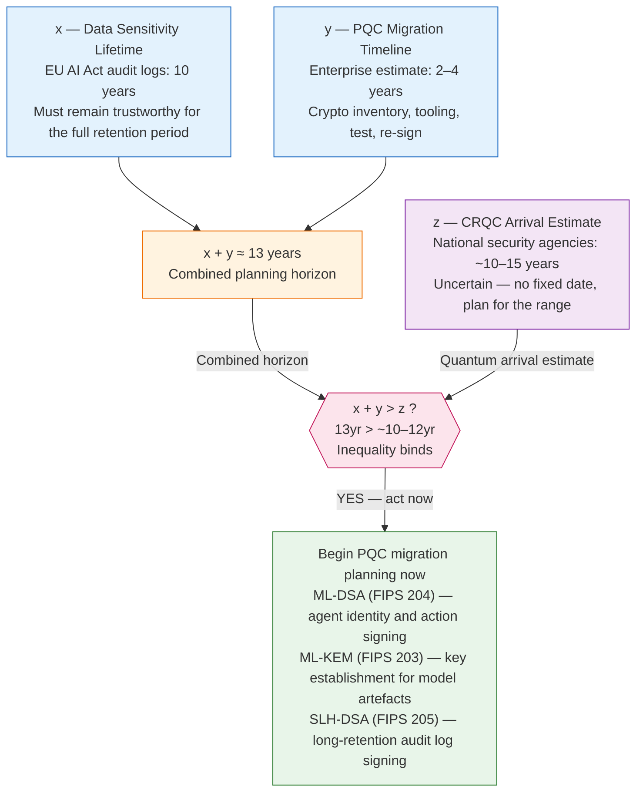

**Series:** AI Security in Practice 
**Pillar:** 6: Emerging Threats and Research 
**Difficulty:** Advanced 
**Author:** Paul Lawlor 
**Date:** 4 August 2026 
**Reading time:** 18 minutes

> AI governance frameworks mandate tamper-evident audit logs, signed decision records, and agent action attestations. The signatures making those records tamper-evident rely on mathematical problems that quantum computers will eventually solve. This is a technical analysis of the quantum threat to AI trust chains — and what to do about it now, before the threat is realised.

---

## Table of Contents

1. [The Landscape](#1-the-landscape)
2. [Threat Model](#2-threat-model)
3. [Technical Deep Dive](#3-technical-deep-dive)
4. [Case Studies](#4-case-studies)
5. [Patterns and Trends](#5-patterns-and-trends)
6. [Defensive Recommendations](#6-defensive-recommendations)
7. [Open Questions](#7-open-questions)
8. [Summary and Outlook](#8-summary-and-outlook)

---

## 1. The Landscape

In August 2024, the National Institute of Standards and Technology published three Federal Information Processing Standards: FIPS 203, FIPS 204, and FIPS 205 — the culmination of an eight-year competition to standardise post-quantum cryptography.[^1] The publication was the cryptographic community's formal acknowledgement of a fact it had known since 1994: Shor's algorithm, running on a sufficiently powerful quantum computer, breaks RSA and elliptic curve cryptography entirely. Not weakens — breaks. The signatures protecting the majority of digital trust infrastructure on the internet will eventually be forgeable.

That same year, the EU AI Act entered into force.[^2] Article 12 mandates that providers of high-risk AI systems keep logs of their systems' operation, sufficient to enable monitoring for compliance with the Act's requirements. Article 17 requires a quality management system with documented procedures and evidence of outputs. Article 9 requires risk management documentation that must be kept for the lifetime of the system, or at least ten years. The Act does not specify how these records must be protected against tampering — only that they must be.

Two landmark documents, born in the same calendar year, from communities that almost never speak to each other. One says: the mathematics underlying your digital signatures will eventually fail. The other says: you must keep tamper-evident records of your AI systems' behaviour, for a decade or more, and they must be trustworthy enough to withstand regulatory scrutiny and legal challenge.

The organisations racing to build AI governance infrastructure to satisfy the EU AI Act, the NIST AI Risk Management Framework, and the UK Government's AI Governance Code are doing so with classical cryptographic signing at the foundation. Every day those systems operate, they accumulate a growing body of audit logs, decision records, model cards, and agent action attestations — all signed with ECDSA or RSA — that will, eventually, be forgeable by an adversary with access to a cryptographically relevant quantum computer (CRQC).

This is the governance gap. Not a gap in the regulations, which are already demanding. Not a gap in the technology, since the replacement algorithms exist and are standardised. A gap in awareness: the people building AI governance infrastructure are not the people who read NIST FIPS publications, and the cryptographers who do read those publications are not thinking about EU AI Act compliance workflows.

The threat has a name in the cryptographic literature: Harvest Now, Decrypt Later, or HNDL. Applied to AI governance, it becomes something subtler and more dangerous: Harvest Now, *Forge* Later. Collect the signed artefacts today. Wait for quantum capability. Then rewrite the historical record.

---

## 2. Threat Model

The threat model for quantum attacks on AI governance differs significantly from other adversaries discussed on this site. The [AI worm](/emerging-threats-and-research/ai-worms/) adversary needs real-time access to live systems.[^3] The [sleeper agent](/emerging-threats-and-research/sleeper-agent-attacks/) adversary needs access to the training pipeline.[^4] The quantum governance adversary needs neither. They need two things, separated by time: the signed artefacts themselves, and eventual access to a CRQC.

**The adversary.** Nation-state actors are the primary threat in the near term — the actors most likely to invest in collecting signed governance artefacts today with a view to exploitation a decade from now. The VENONA programme, the NSA's decades-long effort to decrypt Soviet diplomatic traffic from the 1940s, is the historical proof of concept: messages sent in 1944 were decrypted in the 1960s and 1970s using cryptanalytic advances that postdated the original transmission.[^5] The Soviets' keys were mathematically flawed; today's classical signatures are not flawed in implementation but in their mathematical foundations, which are vulnerable to a computational model that does not yet exist at scale. The adversary's collection phase requires no technical sophistication — only the foresight to store what is freely or semi-freely available.

In the longer term, as quantum capability matures, the adversary class broadens. Regulatory arbitrage — forging compliance records to retroactively demonstrate compliance with AI governance requirements that were not actually met — becomes a commercial, not just geopolitical, threat.

**The target surface.** AI governance generates a specific class of high-value signed artefacts:

*Audit logs.* The EU AI Act's Article 12 logs, NIST AI RMF governance records, and internal compliance audit trails. Retained for years, often semi-public through regulatory disclosure processes, and signed to establish tamper-evidence.

*Agent action attestations.* Records of what autonomous agents did, under what authority, and when. In well-governed agentic deployments, these are signed by the agent's identity key. In multi-agent systems, action attestations may chain through multiple agents, each delegating authority to the next.

*Model cards and compliance attestations.* Signed documents asserting the provenance, training methodology, and risk assessment of a deployed model. Under EU AI Act obligations, these must be both accurate and tamper-evident. A forgeable model card is a forgeable compliance record.

*Agent identity certificates.* The cryptographic basis for asserting that this agent is who it claims to be. Typically X.509 certificates issued by an internal certificate authority, signed with ECDSA or RSA.

*Federated learning participation records.* In privacy-preserving ML deployments, records of which organisations participated, what gradient updates were submitted, and how aggregation was performed. These may carry regulatory weight in healthcare and financial services contexts.

**The attack.** The adversary's strategy is passive collection followed by delayed forgery. Unlike active attacks, there is no intrusion, no anomaly to detect, no real-time indicator of compromise. The collection phase looks like normal network traffic. The forgery phase — which may occur a decade later — produces artefacts that are cryptographically indistinguishable from legitimate records signed by the original system.

The practical consequence: an organisation that discovers in 2036 that its 2026 AI compliance records have been retroactively forged has no technical means of demonstrating that the forgery occurred, because the forged signatures are valid under the original algorithm. The chain of trust is broken not at a point in time that can be identified — it is broken retrospectively, everywhere the original algorithm was used.

*Figure 1. Harvest Now, Forge Later — three-phase attack timeline. Collection requires no intrusion; forgery is retrospective and cryptographically undetectable.*

This is qualitatively different from a data breach. A data breach exposes what exists. Harvest-now-forge-later attacks *change* what is believed to have existed. The implications for regulatory compliance, legal liability, and organisational accountability are substantial.

---

## 3. Technical Deep Dive

**Why classical signatures fail against quantum adversaries.**

RSA signatures derive their security from the computational hardness of factoring the product of two large prime numbers. ECDSA and EdDSA derive their security from the hardness of the elliptic curve discrete logarithm problem: given a point P and its scalar multiple Q = kP on an elliptic curve, finding k is computationally infeasible for any classical algorithm.

In 1994, Peter Shor published a quantum algorithm that solves both problems in polynomial time.[^6] On a quantum computer with sufficient logical qubits and error correction, Shor's algorithm factors an n-bit integer in O(n³) operations — polynomial, not exponential. The elliptic curve discrete logarithm yields to a variant with similar complexity. The implication: any signature scheme whose security rests on integer factorisation or the discrete logarithm — RSA, ECDSA, EdDSA, ECDH — is broken in principle by Shor's algorithm. Increasing key sizes provides no refuge; the algorithm's polynomial complexity means that doubling the key size increases the quantum computational cost only polynomially, not exponentially.

**Hash functions fare better, but not completely.**

Grover's algorithm (1996) provides a quadratic speedup for searching unstructured spaces.[^7] Applied to hash preimage attacks, it reduces the effective security level by half. SHA-256 drops from 256-bit to approximately 128-bit post-quantum security. SHA-3-256 is similarly affected. This is weakening, not breaking: 128-bit post-quantum security is the current minimum standard and remains acceptable for most purposes. SHA-3-384 provides 192-bit post-quantum security, appropriate where long-retention records require a larger safety margin.

The combination creates a specific problem for audit log architectures. A common pattern is: individual log entries linked by SHA-256 hash chains, with ECDSA signatures applied periodically to batch roots, committing the chain state at intervals. The hash chains survive quantum with reduced but acceptable security. The ECDSA batch signatures do not. An adversary with a CRQC can forge the batch signatures, allowing them to substitute modified log entries that hash-chain correctly to modified batch roots — with batch signatures that verify as valid under the original algorithm. The hash chain provides no residual protection because the signatures anchoring it are forgeable.

*Figure 2. Audit log architecture — where the trust chain breaks. SHA-256 hash chains survive quantum (weakened); ECDSA batch signatures do not. The forged output verifies as valid under the original algorithm.*

**The NIST post-quantum standards.**

FIPS 204 (ML-DSA) standardises the Module Lattice Digital Signature Algorithm, based on CRYSTALS-Dilithium.[^1] Its security is based on the hardness of the Module Learning With Errors (MLWE) problem, which is believed to resist attack by both classical and quantum algorithms. ML-DSA provides three parameter sets: ML-DSA-44 (security comparable to AES-128), ML-DSA-65 (AES-192), and ML-DSA-87 (AES-256). For AI governance artefacts with multi-year retention requirements, ML-DSA-65 or ML-DSA-87 is appropriate. ML-DSA signatures are larger than ECDSA — ML-DSA-65 produces 3,293-byte signatures versus ECDSA-P256's 64 bytes — but for document signing and audit log batches, this is an acceptable cost.

FIPS 205 (SLH-DSA) standardises the Stateless Hash-Based Digital Signature, based on SPHINCS+.[^1] Its security rests on the properties of the underlying hash function only — no lattice assumptions, no algebraic structure that a future cryptanalytic advance might unexpectedly weaken. For long-retention audit log signing where the goal is to minimise exposure to any future mathematical surprise, SLH-DSA is the conservative choice. Signatures are substantially larger than ML-DSA (7,856 bytes for SLH-DSA-SHA2-128s) but signing is well-suited to batch operations.

FIPS 203 (ML-KEM) standardises the Module Lattice Key Encapsulation Mechanism, based on CRYSTALS-Kyber.[^1] This replaces classical key establishment — relevant to the encrypted transmission of model weights, training data, and API authentication material — rather than to document signing. Where AI governance artefacts are transmitted over encrypted channels with classical key exchange, ML-KEM is the relevant replacement.

**Cryptographic agility and the agentic signing problem.**

Cryptographic agility is the architectural property that allows a system to switch signing algorithms without restructuring the dependent systems that consume signed artefacts. It requires: algorithm identifiers embedded in every signed artefact (so that verifying parties know which algorithm to use), simultaneous support for multiple algorithms during migration periods, and key rotation policies that account for algorithm transitions rather than only key age.

For agentic systems, the signing problem has additional dimensions. In an orchestrated multi-agent pipeline, individual agents hold identity credentials — typically X.509 certificates — and sign the actions they take. A senior agent may delegate authority to a sub-agent through a chain of signed tokens. The policy engine governing the system may sign its decisions. Each of these is an additional classical signing key that falls under the quantum threat.

The Model Context Protocol (MCP), the emerging standard for AI tool integration, similarly creates signing surfaces: MCP server authentication, tool description integrity, and tool-call authorisation records. As MCP becomes infrastructure for agentic systems — the plumbing through which agents invoke external capabilities — the cryptographic hygiene of MCP connections becomes a governance concern.

The practical consequence: the cryptographic inventory for an agentic AI system is substantially larger than the inventory for a conventional application. It includes not only TLS certificates and API authentication material, but every agent identity key, every policy signing key, every audit log signing key, and every tool-call authorisation token.

*Figure 3. Agentic trust chain — the quantum attack surface. Every ECDSA signing key in an orchestrated pipeline is a forgery target. Collection is passive; forgery is retrospective.*

**The Mosca inequality.**

Michele Mosca of the University of Waterloo formalised the urgency calculation in 2018.[^8] Define x as the number of years your data or artefacts must remain secure, y as the number of years it will take your organisation to migrate to post-quantum cryptography, and z as the number of years until a CRQC arrives. If x + y > z, you have a problem today — because the migration will not be complete before your data needs to be secure against a quantum adversary. For AI governance artefacts with ten-year regulatory retention requirements and realistic migration timelines of two to five years, the Mosca inequality binds under any CRQC timeline estimate shorter than fifteen years. Current estimates range from ten to twenty years.[^9]

*Figure 4. The Mosca inequality — if x (sensitivity lifetime) + y (migration time) > z (CRQC arrival), your planning horizon is already too short. For 10-year EU AI Act retention, it binds today.*

---

## 4. Case Studies

**Scenario A: Retroactive audit log forgery in a high-risk AI deployment.**

A financial services firm deploys an AI credit-decisioning system subject to EU AI Act high-risk obligations. Audit logs record every decision, the model version, the input features used, the output score, and the date. Batch log records are committed daily with an ECDSA-P256 signature. The logs are retained for ten years and disclosed in summary form to the relevant competent authority. An adversary with access to those disclosed summaries — and to the signed batch records accessible through the firm's data subject access process — collects batch signatures over a four-year period. When quantum capability becomes available, the adversary forges replacement batch signatures for a targeted date range, and simultaneously modifies the log entries for that period to show that the AI system applied different decision criteria to a specific demographic population. The forgery passes cryptographic verification. The firm cannot demonstrate that the original logs were not the forged ones. The regulatory and litigation consequences follow from a compliance record the organisation never actually held.

**Scenario B: Model card forgery and false provenance.**

A medical AI company develops a diagnostic model trained on a proprietary clinical dataset assembled under specific consent and licensing terms. The model card, signed with ECDSA at time of deployment, attests to the training data provenance, the risk assessment methodology, and the bias evaluation results. A competitor, seeking to discredit the model's regulatory approval, collects the signed model card. A decade later, with quantum capability, they forge a replacement model card that asserts the original training data included unconsented patient records and that the bias evaluation was not performed. The forged model card is cryptographically indistinguishable from the original. The regulatory withdrawal of the model's approval is based on a record the company never produced.

**Scenario C: Agentic trust chain compromise.**

An enterprise deploys a multi-agent system for infrastructure management. The orchestrator agent holds an ECDSA identity certificate issued by an internal certificate authority. It delegates authority to sub-agents through signed delegation tokens specifying permitted actions. Every action taken by a sub-agent is recorded in a signed action log, countersigned by the orchestrator. The policy enforcement engine logs its decisions with its own ECDSA key. An adversary passively records agent certificate exchanges, delegation tokens, and action logs over three years — all of which transit the network during normal operations. When quantum capability is available, the adversary forges: a new orchestrator certificate, delegation tokens asserting unrestricted authority, and action log entries purporting to show that the system had been used to exfiltrate data over an extended period. The forged records implicate the organisation in a historical data exfiltration that never occurred. The organisation's defence depends on demonstrating that the forged records are not authentic — which it cannot do cryptographically.

**Scenario D: Foundation model intellectual property theft via HNDL.**

A UK defence contractor develops a specialised AI model representing three years of training compute on classified technical documentation. The model weights are stored encrypted with AES-256, secured with RSA-3072 key encapsulation for access control. The AES-256 encryption is quantum-resistant at 128-bit effective security. The RSA-3072 key encapsulation is not. A nation-state adversary exfiltrates the encrypted weight files — feasible through supply chain compromise, credential theft, or misconfigured cloud storage. The adversary also records the RSA-encrypted key material from authentication sessions. Twelve years later, the adversary uses a CRQC to factor the RSA modulus, recover the AES key, and decrypt the model weights. The model has depreciated commercially but the training data provenance — including classified technical specifications embedded in the training corpus — is now accessible. The theft occurs silently, retrospectively, with no point of intrusion visible in the organisation's historical logs.

---

## 5. Patterns and Trends

**The compliance gold rush is creating the attack surface.** The EU AI Act's phased enforcement timeline — with high-risk AI obligations applying from August 2026 — has triggered a wave of AI governance infrastructure deployment. Organisations are building audit logging systems, signing pipelines, model registries, and compliance attestation workflows under time pressure. Each new governance system deployed with classical signing adds to the aggregate volume of eventually-forgeable artefacts. The faster the compliance build-out, the larger the attack surface.

**Agentic AI amplifies the signing surface.** Conventional AI systems produce relatively simple governance artefacts: decision logs, model version records, input-output pairs. Agentic systems produce a qualitatively richer set of signed material: agent identity certificates, delegation chains, tool-call records, policy enforcement decisions, inter-agent communication logs, and memory state snapshots for long-running agents. Each of these is an additional classical signing key, an additional category of artefact to be harvested, and an additional forgery target. The shift from single-shot inference to persistent agentic architectures — which is accelerating — multiplies the governance signing surface by an order of magnitude.

**The CRQC timeline is uncertain, and that is the point.** Estimates for cryptographically relevant quantum computers range from ten to twenty-plus years.[^9] Some researchers argue the lower bound; others point to the engineering challenges of error correction and maintain that thirty years is more realistic. The uncertainty is not a reason for inaction — it is precisely the reason for action now. The Mosca inequality does not require a fixed CRQC arrival date; it requires only that the data sensitivity lifetime plus the migration timeline might exceed it.[^8] For audit logs with ten-year regulatory retention requirements, the sensitivity lifetime is already long enough to warrant concern under any realistic CRQC estimate.

**Governments are already migrating.** The NSA's Commercial National Security Algorithm Suite 2.0 (CNSA 2.0) mandates that National Security Systems exclusively use post-quantum algorithms for digital signatures by 2030, and for key establishment by 2033.[^10] NCSC guidance for UK organisations recommends beginning migration planning now.[^11] These are not academic documents — they are operational mandates from national security agencies for production systems. AI governance frameworks have not incorporated equivalent language, but the organisations deploying AI in government and regulated sectors are subject to both sets of requirements simultaneously.

**The regulatory gap is closing, slowly.** ENISA's post-quantum cryptography guidance[^12] addresses general migration concerns. The EU's NIS2 directive creates obligations for cryptographic hygiene in critical infrastructure operators — many of whom are also subject to EU AI Act obligations. The intersection of these two regulatory tracks is not yet explicit in guidance, but regulators are beginning to connect them. Organisations that have not begun AI governance crypto-agility planning will eventually be asked about it.

---

## 6. Defensive Recommendations

**1. Conduct a cryptographic inventory that includes AI governance assets.**

Standard cryptographic inventories audit TLS certificates, API keys, and database encryption. They typically miss the signing infrastructure specific to AI governance. Extend your inventory to include: every key used to sign audit log batches, every agent identity certificate, every model card or compliance attestation signing key, every policy enforcement log signing key, and every key establishment mechanism used to protect model weights and training data. Tag each asset with the algorithm in use, the expected lifetime of the signed artefact, and the regulatory or commercial consequence of future forgery.

**2. Prioritise long-lived artefacts for immediate PQC migration.**

Not everything needs to be migrated immediately. Prioritise by: (a) sensitivity lifetime — artefacts retained for ten or more years under regulatory obligation are highest priority; (b) commercial value — model weights for high-value proprietary models; (c) legal weight — compliance attestations and audit logs likely to be referenced in regulatory proceedings or litigation. For these categories, begin migrating signing infrastructure to ML-DSA (FIPS 204) or SLH-DSA (FIPS 205) now, using hybrid classical/PQC signing schemes during the transition period to maintain verifiability for parties that have not yet migrated.

**3. Design agentic systems with cryptographic agility from the outset.**

New agentic deployments should embed algorithm identifiers in every signed artefact — agent tokens, action records, policy decisions, audit entries — so that algorithm migration does not require re-architecture of dependent verification systems. Adopt ML-DSA for agent identity certificates and action attestation in new deployments. Define and document migration paths for signed artefacts before quantum capability arrives. Assess whether cryptographic agility can be retrofitted at the orchestration layer for existing systems — changing the signing algorithm at the orchestrator rather than at each individual agent.

**4. Move audit log signing to post-quantum algorithms.**

Migrate audit log batch signing from ECDSA or RSA to ML-DSA-65 or SLH-DSA-SHA2-128s. The signature size increase is acceptable for batch signing; individual log entries need not be individually signed, only the Merkle tree root or rolling hash chain state committed at each signing interval. Where SHA-256 is in use for hash chains, upgrade to SHA-3-256 minimum; SHA-3-384 for logs with legal retention requirements beyond ten years. Document the algorithm transition in the log metadata so that future auditors can verify the migration was performed.

**5. Incorporate quantum readiness into your AI risk register.**

Under the NIST AI RMF and ISO 42001, AI systems require documented risk registers. Quantum threat to cryptographic governance infrastructure is a legitimate, credible risk that belongs in that register. Document the threat, the current cryptographic inventory, the planned migration timeline, and the residual risk of legacy signed artefacts that predate the migration. This establishes a documented position that demonstrates awareness and planning — relevant to both regulatory scrutiny and potential liability for governance failures.

**6. Apply the Mosca inequality to your planning horizon.**

Calculate your organisation's position against the Mosca inequality. For each category of AI governance artefact, estimate: the sensitivity lifetime (how long must this artefact remain trustworthy?), the migration timeline (how long will it take to migrate the signing infrastructure for this artefact class?), and assess whether their sum creates urgency given any reasonable CRQC timeline estimate. For most organisations with multi-year regulatory retention requirements, the calculation resolves in favour of beginning migration now.

---

## 7. Open Questions

**When will CRQCs arrive, and does the timeline change the answer?** Current estimates from NIST and national security agencies assume fifteen to twenty years as the planning horizon.[^9] IBM, Google, and others have published roadmaps suggesting that the engineering challenges of error correction may constrain quantum advantage in cryptographically relevant operations for longer. The question practitioners face is not "when exactly?" but "is our planning horizon long enough?" For audit logs with ten-year regulatory retention requirements, beginning migration now is warranted under any CRQC timeline estimate shorter than fifteen years.

**Can cryptographic agility actually be retrofitted into deployed agentic systems?** Many existing agentic deployments have signing algorithms hardcoded into orchestration frameworks, policy engines, and logging infrastructure. The assumption that cryptographic agility can be added at the orchestration layer without touching individual agents is optimistic for some architectures. Understanding the real migration cost for existing systems — not idealised greenfield deployments — requires empirical assessment that the industry has not yet systematically performed.

**How will AI governance regulators respond?** The EU AI Act does not currently specify post-quantum cryptographic requirements. NIST AI RMF is silent on the subject. As awareness grows, regulatory guidance will likely evolve. Organisations that have begun PQC migration planning will be better positioned to demonstrate compliance with whatever requirements emerge. Those that have not begun may face retroactive pressure to demonstrate that historical signed artefacts were produced under adequate cryptographic controls — a difficult position if the originating systems have been decommissioned.

**What are the implications for the retro-certification problem?** If an organisation migrates its signing infrastructure to PQC in 2027, what is the status of artefacts signed with classical algorithms in 2025 and 2026? These artefacts cannot be re-signed without potentially breaking the chain of custody that makes them legally and regulatorily valid. Trusted timestamping services and hybrid signing schemes offer partial mitigations, but the question of how to establish the authenticity of historically signed governance artefacts in a post-CRQC world does not yet have a settled answer.

**Which multi-party computation and homomorphic encryption schemes are already quantum-safe?** Homomorphic encryption schemes based on Ring Learning With Errors (RLWE) — including BFV, BGV, and CKKS — are already believed to be post-quantum resistant, since their security assumptions overlap with those of the lattice-based NIST standards. RSA-based HE schemes are not. For federated learning deployments, the quantum safety of the aggregation protocol depends on which underlying scheme is in use. This is not well-documented in most ML framework deployments.

---

## 8. Summary and Outlook

The VENONA project ran for more than thirty years.[^5] The NSA began collecting Soviet diplomatic traffic in 1943. The first decrypts came in 1946, exploiting a cryptographic weakness the Soviets didn't know they had introduced. The last VENONA decrypts were produced in 1980. Messages sent in wartime were read decades later, enabling the identification of intelligence assets whose activities had long since concluded. The cryptographic weakness was in the key material — one-time pads reused under production pressure. The exploitation was patient, sustained, and retrospective.

The harvest-now-forge-later threat to AI governance artefacts follows the same logic. The weakness is not in the implementation but in the mathematical foundations of the signing algorithms. The exploitation is patient — it requires only that someone with quantum capability eventually turns their attention to the collected artefacts. The consequences are retrospective — they affect the historical record of what AI systems did, under what authority, with what outcome.

The regulatory environment is accelerating the accumulation of that record. The EU AI Act, the NIST AI RMF, and the UK's AI Governance Code are between them creating the largest structured corpus of signed AI governance artefacts in history. Every new compliance workflow deployed with classical signing adds to what will eventually be the target set.

The cryptographic community has done its part. FIPS 203, 204, and 205 exist. The algorithms are standardised, implemented, and available in major cryptographic libraries. The migration path is clear. What remains is the awareness gap: connecting the regulatory obligation to maintain trustworthy AI governance records with the cryptographic reality that the algorithms currently used to establish that trustworthiness have a known, eventual failure mode.

**This week.** Three actions for practitioners: (1) Add quantum threat to cryptographic governance infrastructure to your AI risk register, with a documented inventory of current signing algorithms and artefact retention periods. (2) Identify one category of long-lived AI governance artefact — audit logs, model cards, or agent identity certificates — and assess the cost of migrating its signing infrastructure to ML-DSA or SLH-DSA. (3) For any new agentic system in design or early development, add cryptographic agility as an explicit architectural requirement before the first agent identity certificate is issued.

**Looking ahead.** The quantum threat to AI governance is not a distant horizon problem. For organisations with ten-year regulatory retention obligations, the Mosca inequality already bites. For organisations deploying agentic systems at scale, the signing surface is growing faster than most cryptographic inventories can track. The governance gap between what AI compliance frameworks require and what they specify about cryptographic durability will close — either because organisations proactively bridge it, or because regulators mandate it after the first high-profile forgery event demonstrates why it matters.

The VENONA lesson is not that the Soviets should have used longer keys. It is that cryptographic assumptions decay over time, and governance artefacts outlive the assumptions under which they were secured. The AI governance infrastructure being built today is being built to last a decade. The cryptographic assumptions it rests on may not.

---

[^1]: National Institute of Standards and Technology (2024). *Federal Information Processing Standards 203, 204, and 205: Post-Quantum Cryptography Standards.* NIST. https://www.nist.gov/news-events/news/2024/08/nist-releases-first-3-finalized-post-quantum-encryption-standards
[^2]: European Parliament and Council (2024). *Regulation (EU) 2024/1689 of the European Parliament and of the Council — Artificial Intelligence Act.* Official Journal of the European Union. https://eur-lex.europa.eu/legal-content/EN/TXT/?uri=CELEX:32024R1689
[^3]: Cohen, S., Bitton, R., and Nassi, B. (2024). *Here Comes The AI Worm: Unleashing Zero-click Worms that Target GenAI-Powered Applications.* arXiv:2403.02817. https://arxiv.org/abs/2403.02817
[^4]: Hubinger, E. et al. (2024). *Sleeper Agents: Training Deceptive LLMs that Persist Through Safety Training.* arXiv:2401.05566. https://arxiv.org/abs/2401.05566
[^5]: National Security Agency. *VENONA.* Declassification & Transparency Initiatives, Historical Releases. https://www.nsa.gov/Helpful-Links/NSA-FOIA/Declassification-Transparency-Initiatives/Historical-Releases/Venona/
[^6]: Shor, P.W. (1994). Algorithms for quantum computation: discrete logarithms and factoring. *Proceedings of the 35th Annual Symposium on Foundations of Computer Science (FOCS).* IEEE. Expanded version: arXiv:quant-ph/9508027. https://arxiv.org/abs/quant-ph/9508027
[^7]: Grover, L.K. (1996). A fast quantum mechanical algorithm for database search. *Proceedings of the 28th Annual ACM Symposium on Theory of Computing (STOC).* ACM. arXiv:quant-ph/9605043. https://arxiv.org/abs/quant-ph/9605043
[^8]: Mosca, M. (2018). Cybersecurity in an era with quantum computers: will we be ready? *IEEE Security & Privacy,* 16(5), 38–41. Open-access preprint: https://eprint.iacr.org/2015/1075
[^9]: National Academies of Sciences, Engineering, and Medicine (2019). *Quantum Computing: Progress and Prospects.* The National Academies Press. https://doi.org/10.17226/25196
[^10]: National Security Agency (2022). *Commercial National Security Algorithm Suite 2.0.* NSA Cybersecurity Advisory. https://media.defense.gov/2025/May/30/2003728741/-1/-1/0/CSA_CNSA_2.0_ALGORITHMS.PDF
[^11]: National Cyber Security Centre (2023). *Next steps in preparing for post-quantum cryptography.* NCSC. https://www.ncsc.gov.uk/paper/next-steps-in-preparing-for-post-quantum-cryptography
[^12]: European Union Agency for Cybersecurity (2023). *Post-Quantum Cryptography: Current State and Quantum Mitigation.* ENISA. https://www.enisa.europa.eu/publications/post-quantum-cryptography-current-state-and-quantum-mitigation
