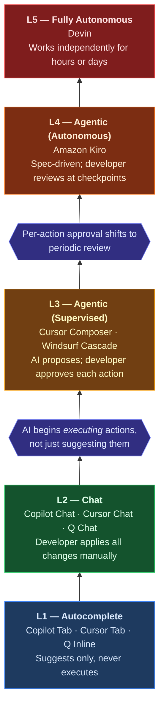

**Series:** AI Security Do's and Don'ts 
**Essay:** The Autonomy Ladder

**Author:** Paul Lawlor 
**Date:** 20 February 2026 
**Reading time:** 12 minutes 
**Word count:** ~2,700 
**Abstract:** AI coding tools now span a wide autonomy spectrum: from passive autocomplete that suggests the next line of code, through chat-driven development, to fully autonomous agents that work independently for hours or days. The security controls appropriate for autocomplete are wholly inadequate for autonomous agents, yet most organisations apply the same policies across all tools. This essay introduces the first autonomy-based taxonomy of AI coding tools -- a five-level classification from L1 (autocomplete) to L5 (fully autonomous) -- and maps proportional security controls to each level. It provides procurement teams, security architects, and engineering leaders with a practical framework grounded in the UK AI Playbook, NCSC guidance, and vendor security documentation.

**Keywords:** autonomy ladder, AI coding tools, GitHub Copilot, Cursor, Windsurf, Amazon Kiro, Devin, agentic AI, UK AI Playbook, human control, proportional security, DevSecOps, AI governance

---

## Contents

1. [Same policy, different planets](#same-policy-different-planets)
2. [The autonomy ladder](#the-autonomy-ladder)
3. [The don'ts: five common mistakes](#the-donts-five-common-mistakes)
4. [The do's: six defensive strategies](#the-dos-six-defensive-strategies)
5. [The organisational challenge](#the-organisational-challenge)
6. [The path forward](#the-path-forward)
7. [Further reading](#further-reading)
8. [Notes](#notes)

---

## Same policy, different planets

An engineering VP at a government delivery partner approved three AI coding tools in the same quarter. Each request followed the same process: a security questionnaire, a vendor risk assessment, and sign-off from the information security team. The approvals were thorough and well-documented.

Team A adopted GitHub Copilot for inline code completions and chat. Developers accepted or rejected suggestions one line at a time. Code review caught the occasional poor suggestion. The tool behaved exactly as the security controls anticipated.

Team B deployed Cursor with its Composer mode for multi-file edits. Developers used chat for explanations and the agent mode to refactor across several files at once. Most edits were reviewed before acceptance, though some multi-file changes were approved with less scrutiny than single-line suggestions. The controls were adequate, if occasionally stretched.

Team C gave Devin, a fully autonomous AI software engineer, a GitHub token and a brief: 'refactor the payments service.' Devin worked independently for days. Six weeks later, a security review found that the agent had committed 312 files across 47 pull requests. It had introduced a dependency with a known CVE. It had refactored authentication logic in a way that weakened input validation. Nobody had reviewed the output with the rigour appropriate for an autonomous system, because the review process was designed for autocomplete.

The problem was not that any team acted recklessly. Each followed the same approved policy. The problem was that the policy treated all three tools as the same thing. A tool that suggests a single line of code and a tool that independently rewrites a payments service are not the same thing. They require fundamentally different security controls. The organisation applied the controls appropriate for Level 1 autocomplete to a Level 5 autonomous agent. The gap was predictable, and it was entirely avoidable.

### Why this matters now

AI coding tools now span a wide autonomy spectrum. GitHub Copilot offers inline completions, chat, agent mode in VS Code, and a coding agent that works autonomously on issues and pull requests.[^1] Cursor provides code completions, chat, and Composer mode with MCP server integration, backed by SOC 2 Type II certification.[^2] Windsurf offers autocomplete, chat, and its Cascade agentic mode, with FedRAMP High accreditation and multiple deployment options.[^3] Amazon Kiro is a spec-driven agentic IDE that works autonomously on complex tasks using a multi-model architecture.[^4] Devin, by Cognition Labs, is a fully autonomous AI software engineer with SOC 2 Type 2 and ISO/IEC 27001:2022 certifications.[^5]

The UK AI Playbook for Government requires 'meaningful human control at the right stages' (Principle 4) and using 'the right tool for the job' (Principle 6).[^6] What constitutes 'meaningful control' for an autocomplete tool is fundamentally different from what it means for an autonomous agent that works unsupervised for hours.

This essay introduces the **autonomy ladder**: a five-level classification that maps proportional security controls to each level of AI coding tool autonomy. It builds on the governance foundation established in *The UK AI Playbook* (Essay A in this series) and the supply chain security foundation established in *The MCP Trap* (Essay B). The autonomy level of an AI coding tool, not its brand or marketing category, should determine the security controls applied to it.

---

## The autonomy ladder

No publicly available resource provides an autonomy-based taxonomy of AI coding tools with proportional security controls mapped to each level. The framework below fills that gap. It draws on Anthropic's Responsible Scaling Policy, which uses ASL levels to impose progressively stricter security requirements as model capability increases.[^7] The same principle applies to AI coding tool autonomy: as capability increases, so must controls.

**Level 1 -- Autocomplete.** Inline code suggestions, single-line or multi-line completions. The developer accepts or rejects each suggestion individually. The AI never executes anything; it only suggests. Examples include GitHub Copilot code completions, Amazon Q inline suggestions, and Cursor Tab.[^1][^2] The primary security concern is data sent to the model provider for inference. Classification controls are needed to ensure sensitive code is not exposed inappropriately.

**Level 2 -- Chat.** Conversational code generation, explanations, and refactoring through a chat interface. The developer receives a response and decides what to apply. Examples include Copilot Chat, Cursor Chat, and Amazon Q Chat.[^1][^2] Larger context windows mean more code is sent per interaction, and responses can span multiple files. The developer must still manually apply each change. The security concern expands to larger data exposure per interaction and the need for context window management.

**Level 3 -- Agentic (supervised).** Multi-file edits with tool use and command execution. The AI proposes actions; the developer approves each one before execution. Examples include Cursor Composer and Agent mode, Windsurf Cascade, and Copilot agent mode in VS Code.[^2][^3][^8] The AI can run commands, install dependencies, and modify multiple files, but requires developer approval at each step. Security concerns include tool execution, dependency introduction, and a multi-file blast radius. Approval gates and MCP server controls (as covered in Essay B) are essential.

**Level 4 -- Agentic (autonomous).** Spec-driven autonomous development. The AI works independently for extended periods, executing multi-step plans without per-action human approval. Amazon Kiro exemplifies this level with its spec-driven development approach, agent hooks, and steering files.[^4] The developer sets requirements via natural language specs; the AI executes autonomously. Human review is periodic, not per-action. Security concerns include extended unsupervised execution, resource consumption, and drift from the original specification. Time limits, cost controls, and kill switches are essential.

**Level 5 -- Fully autonomous.** An independent AI software engineer. Works autonomously for hours or days. Creates pull requests, interacts with CI/CD pipelines, and makes architectural decisions. Devin is the primary example, offering SOC 2 Type 2, ISO/IEC 27001:2022, and VPC deployment options.[^5] Human involvement is minimal during execution. The developer reviews the final output. The AI may have commit access and repository write permissions. Security concerns are at their maximum: multi-party review, detailed audit logs, RBAC with least privilege, VPC isolation, and session limits are all required.

**The critical inflection points.** The jump from L2 to L3 is where the AI starts *executing* actions, not just suggesting them. This is where security controls must step up significantly. The jump from L3 to L4/L5 is where human oversight shifts from per-action approval to periodic review, requiring fundamentally different governance. Most organisations apply L1 controls uniformly. The autonomy ladder makes the gaps visible.

---

## The don'ts: five common mistakes

### Don't 1: Apply the same security policy to L1 autocomplete and L5 autonomous agents

Most organisations create a single 'AI coding tool policy' that covers everything from Copilot completions to Devin. The policy requires 'code review for AI-generated code,' but it does not distinguish between reviewing a single autocompleted line and reviewing 312 files committed autonomously across 47 pull requests. The result is a policy that is either so strict that L1 autocomplete becomes unusable, or so permissive that L5 agents operate without adequate controls.

The Playbook requires 'meaningful human control at the right stages.'[^6] The word 'right' is doing critical work in that sentence. Reviewing each inline suggestion is the right control at L1. It is wholly inadequate at L5, where meaningful control requires multi-party review, audit trails, and rollback procedures. A single policy cannot serve both levels. Separate the policy by autonomy level, or accept that one end of the spectrum is ungoverned.

### Don't 2: Deploy L4 or L5 tools without time-boxed sessions, cost limits, and kill switches

Autonomous agents given open-ended access will run until they finish, or until someone notices they have not stopped. A Devin session left running over a weekend can create hundreds of files, install dozens of new dependencies, and consume significant compute resources. An Amazon Kiro spec task that takes longer than expected accumulates costs through its credit-based metering system.[^4] Nobody is monitoring. Nobody has defined when the session should stop.

The consequence is runaway resource consumption and unreviewed changes accumulating over extended unsupervised periods. The agent compounds its own errors without correction. The Playbook's Principle 5 requires understanding 'how to securely close it down.'[^6] For L4 and L5 tools, 'closing it down' means having time limits, budget caps, and a kill switch that works before the damage is done. Configure these before the first autonomous session, not after the first incident.

### Don't 3: Grant autonomous agents the same repository access as human developers

L4 and L5 tools are often given the same GitHub tokens, repository permissions, and credential scopes as the developers who deploy them. A personal access token with write access to all repositories in the organisation, including production infrastructure-as-code repositories, grants an autonomous agent unrestricted access to modify any codebase.

This violates the principle of least privilege. An autonomous agent refactoring a frontend service does not need write access to the infrastructure repository. Devin's enterprise offering provides fine-grained RBAC with a two-tier role system: organisation-level and account-level roles, with specific permissions such as 'Use Devin Sessions,' 'Manage Settings,' 'Manage Secrets,' and 'Manage MCP Servers.'[^9] The NCSC Zero Trust Architecture principles require verifying explicitly and applying least privilege.[^10] Use the RBAC controls that vendors provide. Scope every token to the minimum permissions the agent needs for its current task.

### Don't 4: Skip defining escalation triggers for when autonomous work must pause for human review

Without predefined criteria for when an autonomous agent should stop and request human review, the agent will continue through security-critical code without hesitation. An L4 tool encounters an authentication module during a refactoring task but continues modifying it autonomously, because no escalation triggers are defined. Authentication logic, cryptographic implementations, infrastructure-as-code, and production configurations are all modified without the human oversight that Principle 4 requires.

The Playbook states that organisations must ensure 'that humans validate any high-risk decisions influenced by AI.'[^6] For autonomous agents, this means defining in advance which files, directories, and code patterns must trigger a pause. The NCSC Guidelines for Secure AI System Development reinforce this: human oversight of AI actions is not optional; it must be designed into the workflow.[^11]

### Don't 5: Select tools based on developer preference without matching autonomy to risk appetite

Tool selection driven by developer enthusiasm rather than a structured assessment of autonomy level versus organisational risk appetite and data classification leads to a predictable outcome. A team handling OFFICIAL-SENSITIVE data adopts a fully autonomous agent because developers appreciate the productivity gains, without assessing whether the data classification permits that autonomy level.

The Playbook's Principle 6 requires using 'the right tool for the job.'[^6] 'Right' means matched to both the task and the data sensitivity. An L5 tool operating autonomously on OFFICIAL-SENSITIVE code may violate the data handling requirements for that classification. Evaluate autonomy level as a security dimension during tool selection, alongside features, cost, and compliance certifications. The autonomy ladder provides the framework for doing so.

---

## The do's: six defensive strategies

### Do 1: Create an autonomy classification for every AI coding tool in your organisation

For every AI coding tool deployed or under evaluation, assign an autonomy level from L1 through L5. Document the classification, the rationale, and the specific security controls required at that level. Maintain this classification as part of the AI systems inventory the Playbook requires: 'organisations should set up an AI and machine learning systems inventory' to provide 'a comprehensive view of all deployed AI systems.'[^12]

Review the classification whenever the tool adds new capabilities. GitHub Copilot was an L1 autocomplete tool; it now includes chat (L2), agent mode (L3), and a coding agent that works autonomously on issues and pull requests (L3/L4).[^1] Cursor was a code editor with completions; it now has an agent mode with MCP server integration.[^2] Tools evolve. Classifications must keep pace, or the controls will fall behind the capability.

### Do 2: Require progressively stricter controls as autonomy increases

Define a control matrix that maps specific security requirements to each autonomy level.

At **L1 and L2**: data classification review, vendor security assessment, privacy mode configuration where available, and standard code review of AI suggestions.

At **L3**: all of the above, plus approval gates for tool execution, dependency introduction review, and MCP server controls as described in Essay B of this series.

At **L4**: all of the above, plus time-boxed sessions, cost limits, automatic termination triggers, and periodic human review checkpoints. Amazon Kiro's credit-based metering with overage controls provides a model for cost governance at this level.[^4]

At **L5**: all of the above, plus multi-party review of all output, RBAC with least privilege, VPC isolation where available, detailed session audit logs, kill switches, and documented rollback procedures. Devin's enterprise deployment supports custom RBAC and VPC deployment on AWS and Azure.[^5][^9] Windsurf's deployment tiers -- Cloud, Hybrid, and Self-hosted -- demonstrate that vendors are building security controls proportional to enterprise requirements.[^3]

This graduated approach implements the Playbook's Principle 3 (Secure by Design) and Principle 4 (proportional human control).[^6]

### Do 3: Mandate human review gates at L3 and above, with multi-party review at L5

At L3, require developer approval before each action the AI proposes. The tool requests permission; the developer decides. This is the default behaviour for Cursor Composer, Windsurf Cascade, and Copilot agent mode.[^2][^3][^8]

At L4, require human review at defined checkpoints: after every spec task completion, after a set number of file modifications, or at regular time intervals. The developer does not approve each action, but reviews progress periodically against the specification.

At L5, require multi-party review of all agent output before merge. At least two reviewers, including one with domain expertise in the affected area. The Playbook states: organisations must ensure 'that humans validate any high-risk decisions influenced by AI.'[^6] At L5, every decision is potentially high-risk because the agent operates unsupervised.

### Do 4: Implement cost and resource quotas proportional to autonomy level

Configure cost limits, compute quotas, and session time limits for L4 and L5 tools. Amazon Kiro uses credit-based metering with flexible overages at defined rates, and usage dashboards that update at least every five minutes.[^4] Devin sessions should have time limits and budget caps configured before the first autonomous run.

Set alerts before limits are reached. Require manual re-authorisation to extend beyond limits. For L5 tools, monitor resource consumption in real time and alert on anomalies: unexpected duration, unusual file volumes, or cost spikes. This satisfies the Playbook's Principle 5 on lifecycle management and cost awareness.[^6]

### Do 5: Maintain detailed audit logs for L3 and above

Log every tool call, file change, dependency introduction, command execution, and API call made by agentic tools. For L4 and L5, logs should include the full reasoning trace: what the agent planned, what it executed, what it changed, and why.

Devin provides session-level audit trails for autonomous work.[^5] Kiro provides spec-to-implementation traceability through its specification documents.[^4] Cursor's enterprise tier provides real-time analytics, including AI lines of code per commit and usage tracking updated every two minutes.[^13]

Store logs in a tamper-evident system. Set alerts for unusual patterns: unexpected file types modified, security-critical directories accessed, new external network connections established, or permissions escalated. This satisfies the Playbook's Principle 5 on monitoring and the NCSC Guidelines on logging and oversight.[^6][^11]

### Do 6: Conduct security assessments specific to the autonomy level before deployment

The security assessment for an L1 tool -- data classification, vendor review, network endpoints -- is fundamentally different from the assessment for an L5 tool, which must additionally cover RBAC configuration, VPC deployment, session controls, rollback procedures, and incident response for agent compromise.

Define assessment templates for each autonomy level. Do not allow a tool to be deployed at a higher autonomy level than the assessment covers. If a tool adds agentic features through an update, reassess before enabling them. The NCSC Guidelines for Secure AI System Development require secure deployment practices and adversarial testing proportionate to the system's capability.[^11] The Playbook's Principle 10 requires 'robust assurance and evaluation.'[^6] Both are satisfied by autonomy-specific assessments.

---

## The organisational challenge

### The classification problem

Most organisations do not have an autonomy classification for their AI coding tools. Tools are approved based on brand recognition or vendor relationship, not autonomy level. A request for 'GitHub Copilot' is assessed once, even though Copilot now spans four autonomy levels: completions (L1), chat (L2), agent mode (L3), and the coding agent (L3/L4).[^1] When a tool adds agentic features -- as Copilot, Cursor, and others have done in the past year -- the security posture should be reassessed. It usually is not.

The first step is straightforward. Inventory every AI coding tool in use across the organisation. Classify each one by autonomy level. Map the gap between current controls and the controls required at that level. The biggest gaps will be at L3 and above, where tools have been approved as autocomplete assistants but now operate as supervised or autonomous agents.

### The proportionality challenge

The Playbook requires meaningful human control, but it does not define what 'meaningful' means at each autonomy level.[^6] This essay provides that definition. At L1, reviewing individual suggestions is sufficient. At L3, approving each proposed action before execution is the minimum. At L5, multi-party review with domain expertise is required.

The challenge is cultural as much as procedural. Developers using L3 and above often trust the AI's output because it looks reasonable, just as they trusted L1 suggestions. But the stakes are different. An L1 suggestion affects a single line. An L5 agent modifies hundreds of files across a codebase. The review habits are the same; the blast radius is not. The NCSC Guidelines reinforce this: human oversight must be proportionate to the system's capability and the potential impact of its actions.[^11]

### The procurement challenge

Procurement teams evaluate AI coding tools based on features, cost, and compliance certifications, but rarely assess autonomy level as a security dimension.[^14] Windsurf's FedRAMP High accreditation and Devin's ISO/IEC 27001:2022 certification demonstrate that vendors take compliance seriously.[^3][^5] But certification does not replace autonomy-appropriate controls configured by the customer. A SOC 2 Type II report confirms the vendor's internal controls; it does not confirm that the customer has implemented time limits, RBAC, or escalation triggers for autonomous sessions.

Procurement evaluation criteria should include three questions: what is the maximum autonomy level this tool supports? What controls does the vendor provide for that level? What controls must the customer implement? The Playbook's Principle 8 requires working 'with commercial colleagues from the start.'[^6] Autonomy classification gives commercial colleagues a concrete framework for evaluating security alongside features and cost.

---

## The path forward

### Why the ladder matters

The AI coding tool market is converging on agentic capabilities. Tools that were L1 a year ago are now L3. GitHub Copilot added a coding agent. Cursor added agent mode. Amazon launched Kiro. Windsurf built Cascade. The direction is clear: more autonomy, not less. The autonomy ladder is not static. It is a framework for assessing tools as they evolve.

The core insight is simple: the autonomy level, not the tool brand, determines the security posture. A GitHub Copilot instance running in agent mode requires different controls from a Copilot instance doing autocomplete, even though it is the same product.[^1] A Cursor deployment with Composer in agent mode is a different security proposition from Cursor with only Tab completions enabled.[^2]

Anthropic's Responsible Scaling Policy provides the conceptual parallel. ASL-2, ASL-3, and ASL-4 represent progressively stricter security requirements as model capability increases.[^7] The autonomy ladder applies the same logic to AI coding tools: as the tool's autonomy increases, the security controls must scale proportionally. Google's Secure AI Framework (SAIF 2.0) reinforces this approach, addressing progressive security layers for increasingly capable AI systems, including autonomous agents.[^15]

### Three actions to take this week

**1. Classify your tools.** List every AI coding tool in use across your organisation. Assign each one an autonomy level from L1 through L5. If you do not know what a tool can do, find out before classifying it. Pay particular attention to tools that have added agentic features since they were originally approved.

**2. Map the control gap.** For each tool, compare the current security controls to what the autonomy level requires. The biggest gaps will be at L3 and above, where tools execute actions rather than just suggest them. Use the graduated control matrix from this essay as a starting point: data classification at L1, approval gates at L3, time limits and kill switches at L4, multi-party review and RBAC at L5.

**3. Set escalation triggers.** For any tool at L3 or above, define the conditions under which the AI must stop and request human review. Security-critical files, authentication logic, cryptographic implementations, infrastructure-as-code, and production configurations should all trigger a mandatory pause. Document these triggers and ensure they are enforced through tool configuration, not just policy.

### Looking ahead

Every major AI coding tool vendor is adding agentic capabilities. The OWASP Top 10 for LLM Applications identifies 'Excessive Agency' as a key risk (LLM06), directly applicable to L3 through L5 tools where AI systems take actions beyond their intended scope.[^16] Organisations that build autonomy-aware governance now will be prepared. Those that do not will face the same scenario described in this essay's opening: the same policy applied to L1 and L5, with predictable consequences.

The Playbook requires meaningful human control (Principle 4) and use of the right tool for the job (Principle 6).[^6] The autonomy ladder makes both principles operational. It turns abstract requirements into specific, auditable controls at each level.

Future essays in this series will cover autonomous agent security in depth (Essay F), building directly on the autonomy framework established here, and prompt injection defences (Essay E), where the risk increases dramatically as autonomy rises. Both depend on the classification this essay provides.

### What to do now

Classify every AI coding tool by autonomy level. Apply proportional security controls: tighter controls for higher autonomy. Share this framework with your security lead, procurement team, and anyone evaluating AI coding tools.

The autonomy level determines the risk. Match the controls to the capability.

---

## Further reading

1. UK AI Playbook for Government (2025) -- Principle 4 (human control), Principle 6 (right tool for the job). Available at: https://www.gov.uk/government/publications/ai-playbook-for-the-uk-government/artificial-intelligence-playbook-for-the-uk-government-html
2. GitHub Copilot Concepts Documentation -- completions, chat, agent mode, coding agent. Available at: https://docs.github.com/en/copilot/concepts
3. Cursor Security Documentation -- SOC 2 Type II, privacy mode, enterprise features. Available at: https://www.cursor.com/security
4. Windsurf Security Documentation -- FedRAMP High, SOC 2, deployment options. Available at: https://codeium.com/security
5. Amazon Kiro FAQ -- spec-driven development, agent hooks, enterprise features. Available at: https://kiro.dev/faq/
6. Devin Enterprise Security -- SOC 2 Type 2, ISO 27001, RBAC, VPC deployment. Available at: https://docs.devin.ai/enterprise/security/enterprise-security
7. Anthropic Responsible Scaling Policy -- ASL tiered security model. Available at: https://www.anthropic.com/news/anthropics-responsible-scaling-policy
8. NCSC Guidelines for Secure AI System Development -- human oversight, secure deployment. Available at: https://www.ncsc.gov.uk/files/Guidelines-for-secure-AI-system-development.pdf
9. Other essays in this series: *The UK AI Playbook* (Essay A), *The MCP Trap* (Essay B)

---

## Notes

[^1]: GitHub, 'Concepts for GitHub Copilot,' GitHub Copilot Documentation. Available at: https://docs.github.com/en/copilot/concepts

[^2]: Cursor, 'Security,' Cursor IDE Security Documentation (last updated January 2026). SOC 2 Type II certified. Available at: https://www.cursor.com/security

[^3]: Codeium, 'Security,' Windsurf IDE Security Documentation. SOC 2 Type II, FedRAMP High accredited, HIPAA compliant. Available at: https://codeium.com/security

[^4]: Amazon Web Services, 'Kiro FAQ,' Amazon Kiro Documentation. Spec-driven development with agent hooks and steering files. Credit-based metering with overage controls. Available at: https://kiro.dev/faq/

[^5]: Cognition Labs, 'Enterprise Security,' Devin Documentation. SOC 2 Type 2, ISO/IEC 27001:2022, CCPA compliant. VPC deployment on AWS and Azure. Available at: https://docs.devin.ai/enterprise/security/enterprise-security

[^6]: UK Government, 'Artificial Intelligence Playbook for the UK Government,' published 10 February 2025. Principle 4: meaningful human control at the right stages. Principle 5: lifecycle management. Principle 6: use the right tool for the job. Principle 3: use AI securely, Secure by Design. Principle 8: work with commercial colleagues from the start. Principle 10: assurance and evaluation. Available at: https://www.gov.uk/government/publications/ai-playbook-for-the-uk-government/artificial-intelligence-playbook-for-the-uk-government-html

[^7]: Anthropic, 'Anthropic's Responsible Scaling Policy,' September 2024. ASL-2, ASL-3, and ASL-4 represent progressively stricter security requirements as model capability increases. Available at: https://www.anthropic.com/news/anthropics-responsible-scaling-policy

[^8]: GitHub, 'Integrating Agentic AI,' GitHub Copilot Enterprise Tutorial. Agent mode workflow, MCP server integration, autonomous task execution. Available at: https://docs.github.com/en/enterprise-cloud@latest/copilot/tutorials/rolling-out-github-copilot-at-scale/enabling-developers/integrating-agentic-ai

[^9]: Cognition Labs, 'Custom Roles and RBAC,' Devin Documentation. Two-tier role system: organisation-level and account-level roles. Fine-grained permissions including Use Devin Sessions, Manage Settings, Manage Secrets, and Manage MCP Servers. SSO integration with Okta and Azure AD. IdP group-based role assignment. Available at: https://docs.devin.ai/enterprise/security-access/custom-roles

[^10]: NCSC, 'Zero Trust Architecture Design Principles.' Verify explicitly, least privilege access, assume breach. Available at: https://www.ncsc.gov.uk/collection/zero-trust-architecture

[^11]: NCSC, CISA, NSA, and international partners, 'Guidelines for Secure AI System Development,' November 2023. Secure deployment, adversarial testing, human oversight requirements. Available at: https://www.ncsc.gov.uk/files/Guidelines-for-secure-AI-system-development.pdf

[^12]: UK Government, 'Artificial Intelligence Playbook for the UK Government,' section on 'Creating an AI systems inventory.' Organisations should set up an AI and ML systems inventory to provide a comprehensive view of all deployed AI systems. Available at: https://www.gov.uk/government/publications/ai-playbook-for-the-uk-government/artificial-intelligence-playbook-for-the-uk-government-html

[^13]: Cursor, 'Enterprise Compliance and Monitoring,' Cursor Enterprise Documentation. Real-time analytics updated every two minutes, AI usage tracking, AI lines of code per commit. Available at: https://cursor.com/docs/enterprise/compliance-and-monitoring

[^14]: UK Government, 'Artificial Intelligence Playbook for the UK Government,' section on 'Buying AI.' The AI supply market is evolving rapidly; engage with commercial colleagues to discuss partners, pricing, products and services. Available at: https://www.gov.uk/government/publications/ai-playbook-for-the-uk-government/artificial-intelligence-playbook-for-the-uk-government-html

[^15]: Google, 'Delivering Trusted and Secure AI,' Secure AI Framework (SAIF 2.0), March 2025. Addresses 15 AI security risks with progressive security layers for autonomous agents. Available at: https://services.google.com/fh/files/misc/google_cloud_delivering_trusted_and_secure_ai.pdf

[^16]: OWASP, 'Top 10 for Large Language Model Applications (2025).' LLM06: Excessive Agency -- AI systems taking actions beyond their intended scope. Available at: https://genai.owasp.org/llm-top-10/
