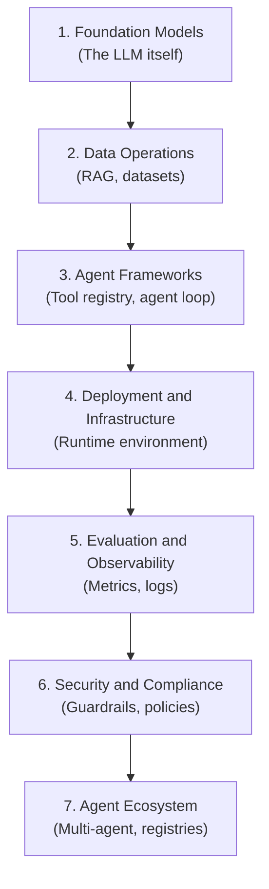
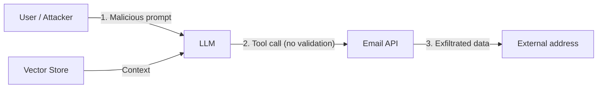

# Threat Modelling Methodologies for AI: STRIDE, ATT&CK, ATLAS, MAESTRO, and When to Use Each

**Series:** AI Security in Practice
**Pillar:** 1: Foundations
**Difficulty:** Beginner-Intermediate
**Author:** Paul Lawlor
**Date:** 5 March 2026
**Reading time:** 17 minutes

> A practical guide to choosing and combining threat modelling frameworks for AI systems, from simple chatbots to agentic AI with tools and multi-agent architectures.

---

## Table of Contents

1. [Why There Are So Many Methodologies](#1-why-there-are-so-many-methodologies)
2. [STRIDE, DREAD, PASTA, VAST, LINDDUN, OCTAVE: Traditional Landscape Summarised](#2-stride-dread-pasta-vast-linddun-octave-traditional-landscape-summarised)
3. [ATT&CK vs ATLAS: Tactics and Techniques for Traditional IT vs AI Systems](#3-attck-vs-atlas-tactics-and-techniques-for-traditional-it-vs-ai-systems)
4. [MAESTRO: When Agentic AI Breaks the STRIDE Model](#4-maestro-when-agentic-ai-breaks-the-stride-model)
5. [What Each Covers: Comparison Table with AI Applicability](#5-what-each-covers-comparison-table-with-ai-applicability)
6. [Decision Matrix: Which Methodology for Which AI Use Case](#6-decision-matrix-which-methodology-for-which-ai-use-case)
7. [Combining Methodologies: Layered Threat Modelling](#7-combining-methodologies-layered-threat-modelling)
8. [Further Reading and Linked Site Articles](#8-further-reading-and-linked-site-articles)

---

## 1. Why There Are So Many Methodologies

A developer building their first LLM-powered application will quickly discover that threat modelling has a crowded landscape. STRIDE, DREAD, PASTA, VAST, LINDDUN, OCTAVE, ATT&CK, ATLAS, MAESTRO. Each framework has advocates, documentation, and a community. The natural question is: why so many, and which one applies to AI?

The answer lies in **when** and **for whom** each methodology was created.

**Design-time vs incident-based.** STRIDE was created at Microsoft in 1999 and became central to the Security Development Lifecycle, built for software architects who draw data flow diagrams before a line of code is written. [^1] It assumes you are designing a system and want to enumerate threats systematically. ATT&CK, by contrast, came from MITRE's work with defenders and red teams who analyse real-world intrusions. [^2] It describes *observed* adversary behaviour, not hypothetical design flaws. Different phases of the security lifecycle demand different lenses: one for building, one for defending.

**General-purpose vs domain-specific.** STRIDE and PASTA were built for conventional software: servers, databases, APIs, trust boundaries between processes and networks. They do not include categories for adversarial machine learning, prompt injection, or model extraction. MITRE ATLAS extends ATT&CK into AI/ML systems, adding techniques such as AML.T0051 (Prompt Injection) and AML.T0018 (Backdoor ML Model). [^3] The Cloud Security Alliance's MAESTRO addresses agentic AI specifically, where trust boundaries are defined by LLM behaviour at runtime rather than by static architecture. [^4] Domain specificity creates new frameworks.

**Threat categories vs attack techniques.** STRIDE gives you six *categories* of threats (Spoofing, Tampering, Repudiation, Information Disclosure, Denial of Service, Elevation of Privilege). You apply them to each element in your diagram. ATT&CK and ATLAS give you *techniques*: specific, observable actions adversaries take. The former helps you think broadly about what could go wrong; the latter helps you map observed incidents to a shared vocabulary and prioritise defences.

**Audiences and tooling.** STRIDE is taught to developers and architects. ATT&CK is used by SOC analysts, red teams, and vendors building detection rules. OWASP's LLM Top 10 speaks to application security practitioners building LLM-powered products. [^5] Each framework has grown around a particular audience and tooling ecosystem.

For AI systems, no single methodology is sufficient. A simple chatbot benefits from STRIDE plus OWASP. An organisation already using ATT&CK for enterprise threat intelligence should add ATLAS. Agentic AI with tools, memory, and autonomous loops requires MAESTRO or equivalent layer-based thinking. The rest of this article explains each approach and provides a decision matrix for choosing and combining them.

---

## 2. STRIDE, DREAD, PASTA, VAST, LINDDUN, OCTAVE: Traditional Landscape Summarised

Before choosing an AI-specific methodology, it helps to understand the traditional threat modelling landscape. These frameworks were built for conventional software; they remain useful for AI systems but have clear gaps.

### STRIDE

**STRIDE** (Spoofing, Tampering, Repudiation, Information Disclosure, Denial of Service, Elevation of Privilege) is the most widely taught design-time methodology. [^1] Microsoft's SDL recommends it for security design review: draw a data flow diagram, label trust boundaries, and for each element ask whether any STRIDE category applies.

| Category | Meaning |
|----------|---------|
| **S**poofing | Making false identity claims |
| **T**ampering | Unauthorised data modification |
| **R**epudiation | Performing actions and denying it |
| **I**nformation Disclosure | Leaking sensitive data |
| **D**enial of Service | Crashing or overloading a system |
| **E**levation of Privilege | Gaining unauthorised privileges |

STRIDE excels at surfacing common vulnerabilities: data tampering at trust boundaries, DoS on APIs, privilege escalation across process boundaries. The SDL notes that **STRIDE may miss important design flaws that only thinking like an attacker will catch.** [^1] It is a checklist, not a substitute for adversarial thinking.

**AI gaps:** STRIDE does not model adversarial machine learning (data poisoning, evasion, model extraction), prompt injection, or autonomous agent behaviour. It assumes static trust boundaries. An LLM that decides at runtime which tools to call creates dynamic trust boundaries that STRIDE was not designed for.

### DREAD

**DREAD** (Damage, Reproducibility, Exploitability, Affected users, Discoverability) is a risk rating scheme often paired with STRIDE. It helps prioritise threats by scoring each on a scale. DREAD is methodology-agnostic: you can rate STRIDE threats, ATT&CK techniques, or OWASP risks with it. Its main weakness is subjective scoring; different teams often produce inconsistent ratings.

### PASTA

**PASTA** (Process for Attack Simulation and Threat Analysis) is a seven-stage, risk-centric methodology. It emphasises attacker motivation analysis and business impact. PASTA's stages include defining objectives, decomposing the application, analysing threats, and simulating attacks. It is more formal than STRIDE but shares the same gap: no focus on adversarial ML, model extraction, or autonomous decision-making.

### VAST

**VAST** (Visual, Agile, Simple Threat modeling) emphasises automation and process flow diagrams. It fits agile development and tool integration. VAST does not model adversarial ML, emergent agent properties, or non-deterministic behaviour. It needs AI-specific extensions for LLM applications.

### LINDDUN

**LINDDUN** (Linkability, Identifiability, Non-repudiation, Detectability, Disclosure, Unawareness, Non-compliance) focuses on *privacy* threats. It is essential when AI systems process PII. LINDDUN does not cover data poisoning, DoS on AI services, model extraction, or autonomy risks. Use it in combination with STRIDE or ATLAS for privacy-sensitive AI.

### OCTAVE

**OCTAVE** (Operationally Critical Threat, Asset, and Vulnerability Evaluation) is an organisational risk methodology. It emphasises critical asset identification and infrastructure vulnerabilities. OCTAVE lacks detail for adversarial examples, data poisoning, and AI agent nuances. Add an AI-specific risk layer when applying it to ML systems.

### Summary

Traditional frameworks excel at conventional software: static architecture, clear trust boundaries, well-understood attack patterns. For AI systems, they provide a foundation but need augmentation. STRIDE plus OWASP LLM Top 10 is a practical starting point for simple LLM applications. When you add tools, memory, or multi-agent behaviour, you need methodologies built for those dynamics.

---

## 3. ATT&CK vs ATLAS: Tactics and Techniques for Traditional IT vs AI Systems

ATT&CK and ATLAS are siblings. Both are MITRE frameworks; both organise adversary behaviour into tactics and techniques. The difference is scope: ATT&CK covers traditional IT infrastructure, ATLAS covers AI and machine learning systems.

### ATT&CK: Traditional IT

**MITRE ATT&CK** (Adversarial Tactics, Techniques, and Common Knowledge) is a globally accessible knowledge base of adversary tactics and techniques based on real-world observations. [^2] It organises behaviour into:

- **Tactics** — high-level attack objectives (e.g. Initial Access, Execution, Persistence, Privilege Escalation)
- **Techniques** — specific methods to achieve those objectives
- **Sub-techniques** — variations of techniques

ATT&CK has matrices for Enterprise (Windows, Linux, cloud), Mobile (Android, iOS), and ICS (industrial control systems). It is used for post-incident mapping, red team exercises, defensive coverage assessment, and threat intelligence sharing.

ATT&CK is a **taxonomy of observed behaviours**, not a design-time methodology. You do not "apply" ATT&CK the way you apply STRIDE to a data flow diagram. Instead, you use it to document which techniques apply to your environment, map incidents to a standard vocabulary, and prioritise detection and response.

### ATLAS: AI and ML Systems

**MITRE ATLAS** (Adversarial Threat Landscape for Artificial-Intelligence Systems) extends the ATT&CK model to AI/ML. [^3] Launched in 2020 (originally the Adversarial ML Threat Matrix, a collaboration between MITRE and Microsoft), ATLAS now covers 15 tactics and 66 techniques, with 33 case studies documenting real-world attacks.

ATLAS tactics include Reconnaissance, Initial Access, ML Model Access, Persistence, Defense Evasion, Collection, Exfiltration, and Impact. AI-specific techniques include:

| Technique | Description |
|-----------|-------------|
| AML.T0051 | LLM Prompt Injection (Direct, Indirect) |
| AML.T0054 | LLM Jailbreak Injection |
| AML.T0018 | Backdoor ML Model |
| AML.T0010 | ML Supply Chain Compromise |
| AML.T0024 | Exfiltration via ML Inference API |
| AML.T0029 | Denial of ML Service |

In October 2025, ATLAS added 14 agentic AI techniques, including Exfiltration via AI Agent Tool Invocation, RAG Database Prompting, Memory Manipulation, and AI Agent Context Poisoning. [^3] These address the unique risks of autonomous agents that interact with real-world data and tools.

### When to Use Each

- **ATT&CK:** Your organisation already uses ATT&CK for enterprise threat modelling, red team playbooks, or SOC detection rules. Use it for the traditional infrastructure your AI system runs on: cloud, containers, APIs, identity.

- **ATLAS:** You are threat modelling an AI or ML system. ATLAS gives you a standard vocabulary for prompt injection, data poisoning, model theft, and agent-specific attacks. Map your AI architecture to ATLAS techniques; use case studies (e.g. Morris II Worm, ShadowRay, MathGPT prompt injection) to ground your analysis in real incidents. [^6]

Organisations using ATT&CK should add ATLAS when assessing AI components. The frameworks share the same tactical structure, so integration is natural. Article 2.06 (The MITRE ATLAS Playbook) provides hands-on guidance for building AI-specific threat models with ATLAS.

---

## 4. MAESTRO: When Agentic AI Breaks the STRIDE Model

Traditional threat modelling assumes **static trust boundaries**. You draw a data flow diagram; trust boundaries sit between processes, networks, and services. STRIDE, PASTA, and VAST work well when the architecture is fixed at design time.

Agentic AI breaks this assumption. Trust boundaries become **dynamic**, defined by the LLM's behaviour at runtime. User input enters through a chat API, reaches the LLM, and the model decides what actions to take: read a file, execute a command, query a database, send an email. Each action crosses a different trust boundary, and the decision is made by a probabilistic model that can be manipulated through the input. This is prompt injection as a new class of code execution: the "code" is natural language and the "interpreter" is an LLM with system privileges. [^7]

**MAESTRO** (Multi-Agent Environment, Security, Threat, Risk, and Outcome) is a threat modelling framework developed by the Cloud Security Alliance specifically for agentic AI. [^4] It fills gaps that STRIDE, PASTA, and even ATLAS do not fully address.

### Gaps in Traditional Frameworks for Agentic AI

MAESTRO identifies several categories of gaps: [^4]

**Autonomy-related:** Goal misalignment, agent unpredictability, emergent behaviour. An agent may pursue a subgoal that contradicts the system's intended behaviour.

**Machine learning-specific:** Model extraction, evasion attacks, data poisoning. These appear in ATLAS but require integration with agent architecture.

**Interaction-based:** Agent-to-agent competition, agent collusion, multi-agent coordination failures. When multiple agents share tools or memory, new trust boundary violations emerge.

**System-level:** Supply chain (provenance, ML libraries, compromised models), dynamic tool invocation without validation between the LLM and tool execution.

### MAESTRO's Seven-Layer Reference Architecture

MAESTRO decomposes agentic AI systems into seven layers, each with associated threats: [^4]

| Layer | Focus | Example Threats |
|-------|-------|------------------|
| 1. Foundation Models | The LLM itself | DoS, reprogramming, data poisoning, membership inference, backdoors, model stealing |
| 2. Data Operations | RAG, datasets | Compromised RAG, data tampering, exfiltration, poisoning |
| 3. Agent Frameworks | Tool registry, agent loop | Framework evasion, supply chain, input validation, backdoors |
| 4. Deployment and Infrastructure | Runtime environment | Lateral movement, resource hijacking, IaC manipulation |
| 5. Evaluation and Observability | Metrics, logs | Poisoning observability, detection evasion |
| 6. Security and Compliance | Guardrails, policies | Model extraction of security agents, explainability gaps |
| 7. Agent Ecosystem | Multi-agent, registries | Capability misdescription, goal manipulation, tool misuse |

**Cross-layer threats** include goal misalignment cascades, data leakage across layers, privilege escalation, lateral movement, and supply chain compromise.

### The Trust Boundary Validation Gap

Real-world scanning of agentic AI codebases reveals a consistent pattern: **trust boundary validation between MAESTRO layers is the most common gap.** [^7] Data flows from user input through the LLM into tool execution with effectively zero validation. A successful prompt injection yields the equivalent of an authenticated shell: the model's output drives shell execution, file access, database queries, and webhooks with no permission model between the LLM and tool execution.

The "helpful assistant" pattern (broad tools, minimal restrictions, long context, persistent memory) creates the largest attack surface. Every agent with tool access produces critical findings; this is a structural property, not a code quality issue.

### When to Use MAESTRO

Use MAESTRO when:

- Your system has **LLM-driven tool invocation** (agents that call APIs, run commands, query databases)
- You have **multi-agent** or **hierarchical** agent architectures
- **Memory** or **context** persists across sessions
- You need to model **cross-layer attack chains** (e.g. Layer 1 → Layer 3 → Layer 4)

STRIDE plus OWASP may suffice for a simple chatbot with no tool access. Once you add tools, agents, or persistent state, MAESTRO's layer-based decomposition and cross-layer threat analysis become necessary.

---

## 5. What Each Covers: Comparison Table with AI Applicability

The following table summarises the methodologies discussed in this article and their applicability to AI systems.

| Methodology | Type | Primary Use | AI Applicability | Key Strengths | Key Gaps for AI |
|-------------|------|-------------|------------------|---------------|------------------|
| **STRIDE** | Design-time, threat categories | Data flow diagrams, trust boundaries | Partial: use for infrastructure, APIs, data stores | Simple, well-understood, teaches systematic thinking | No adversarial ML, prompt injection, dynamic trust boundaries |
| **DREAD** | Risk rating | Prioritisation | Universal: works with any threat list | Structured scoring categories | Subjective, inconsistent across teams |
| **PASTA** | Process, risk-centric | Attack simulation, business impact | Partial: add AI risk categories | Formal, attacker motivation | No adversarial ML, autonomy risks |
| **VAST** | Agile, automated | Process flows, DevOps integration | Partial: needs AI extensions | Tool-friendly, agile fit | No emergent behaviour, non-determinism |
| **LINDDUN** | Privacy-focused | Privacy threat identification | Pair with others for PII | Systematic privacy coverage | No ML-specific threats |
| **OCTAVE** | Organisational risk | Critical assets, infrastructure | Add AI risk layer | Aligns with org risk management | No adversarial ML detail |
| **ATT&CK** | Post-incident, taxonomy | Red team, SOC, incident mapping | Covers traditional infra only | Observed behaviours, detection rules | No AI/ML techniques |
| **ATLAS** | Post-incident, taxonomy | AI/ML threat modelling, incident mapping | Full: prompt injection, poisoning, model theft, agents | AI-specific techniques, case studies, ATT&CK sibling | Requires ATT&CK familiarity for full value |
| **MAESTRO** | Design-time, layer-based | Agentic AI, multi-agent systems | Full: dynamic trust boundaries, cross-layer | Seven-layer decomposition, cross-layer threats | Newer, fewer tools; best for agentic AI |
| **OWASP LLM Top 10** | Risk list | LLM application security | Full: prompt injection, excessive agency, supply chain | Prioritised, application-focused | Risk list, not methodology; pair with STRIDE or ATLAS |

### Methodology Pairs That Work Well

- **STRIDE + OWASP LLM Top 10:** Design-time coverage for simple LLM apps. STRIDE for architecture; OWASP for LLM-specific risks.

- **ATT&CK + ATLAS:** Organisations already using ATT&CK extend to AI with ATLAS. Shared tactical structure; ATLAS covers AI-specific techniques.

- **STRIDE + MAESTRO:** For agentic AI. STRIDE for conventional components (APIs, databases); MAESTRO for the agent layers and cross-layer chains.

- **ATLAS + MAESTRO:** Operational threat intelligence (ATLAS) plus design-time layer analysis (MAESTRO) for complex agentic systems.

---

## 6. Decision Matrix: Which Methodology for Which AI Use Case

Use this matrix to choose the right methodology or combination for your AI system.

| AI Use Case | Primary Methodology | Add These | Why |
|--------------|---------------------|-----------|-----|
| **Simple chatbot** (no tools, no RAG) | STRIDE | OWASP LLM Top 10 | STRIDE covers API, auth, data flows; OWASP covers prompt injection, output handling, disclosure |
| **RAG application** (retrieval + generation) | STRIDE | OWASP LLM Top 10, ATLAS | Add ATLAS for RAG-specific techniques (AML.T0051 indirect injection, vector DB poisoning); OWASP LLM08 (Vector/Embedding Weaknesses) |
| **LLM with tool/function calling** | STRIDE | MAESTRO, OWASP LLM06 (Excessive Agency) | MAESTRO Layers 1–3 for model, data, agent framework; STRIDE for infra; OWASP for agency |
| **Agentic AI** (autonomous loops, memory, multi-tool) | MAESTRO | STRIDE, ATLAS | MAESTRO for seven-layer decomposition and cross-layer threats; STRIDE for deployment; ATLAS for technique mapping |
| **Multi-agent system** | MAESTRO | ATLAS, STRIDE | MAESTRO Layer 7 (Agent Ecosystem) for agent-to-agent; ATLAS agentic techniques; STRIDE for shared infra |
| **Organisation using ATT&CK** | ATLAS | STRIDE, OWASP | Add ATLAS for AI components; STRIDE for design-time; OWASP for LLM risk checklist |
| **Privacy-sensitive AI** (PII, health, finance) | STRIDE or PASTA | LINDDUN, OWASP | LINDDUN for privacy threats; standard methodologies for architecture |
| **Compliance-driven** (EU AI Act, sector regulations) | STRIDE or PASTA | OWASP, NIST AI RMF | Structure around risk categories; OWASP for technical controls; align with NIST Map/Measure/Manage |

### Quick Decision Tree

1. **Does your LLM call tools, APIs, or execute code?**  
   → Yes: MAESTRO (at least Layers 1–3)  
   → No: STRIDE + OWASP may suffice

2. **Does your organisation use ATT&CK for threat intelligence?**  
   → Yes: Add ATLAS for AI components  
   → No: ATLAS still valuable; consider it for incident mapping and red team exercises

3. **Do you have multiple agents interacting?**  
   → Yes: MAESTRO Layer 7, ATLAS agentic techniques  
   → No: Single-agent MAESTRO or STRIDE+OWASP

4. **Is this your first AI threat model?**  
   → Start with STRIDE + OWASP LLM Top 10. Expand when you add tools or agents.

---

## 7. Combining Methodologies: Layered Threat Modelling

Threat modelling is not a single activity. It happens at design time (architecture review), during development (as features change), and after incidents (post-mortem mapping). Different methodologies serve different phases. Combining them creates a layered approach.

### How to Combine Methodologies: Step-by-Step

Use this sequence to avoid overlap and gaps:

1. **Start with STRIDE.** Draw a data flow diagram of your system (including the LLM, any RAG components, tool-calling layer, and external services). Label trust boundaries. For each element and each data flow, ask the six STRIDE questions. Record threats. STRIDE will catch infrastructure and boundary issues; it will miss AI-specific mechanisms.

2. **Apply OWASP LLM Top 10.** Treat LLM01–LLM10 as a checklist. For each risk, ask: does our architecture enable this? Prompt injection (LLM01), excessive agency (LLM06), improper output handling (LLM05), and system prompt leakage (LLM07) apply to most LLM systems. Add any new threats to your list.

3. **Add MAESTRO if you have tools or agents.** Decompose into the seven layers. For Layers 1–4, identify layer-specific threats. Then identify cross-layer threats: paths where an attack at one layer enables an attack at another. Pay special attention to Layer 1 → Layer 3 (model output driving tool choice) and Layer 1 → Layer 4 (tool execution in deployment).

4. **Map to ATLAS.** For each threat you have identified, find the corresponding ATLAS technique (if any). This gives you a standard vocabulary for documentation and incident mapping. It also reveals techniques you may have missed: browse the ATLAS matrix for your deployment pattern and add any applicable techniques.

5. **Prioritise and track.** Use DREAD or your organisation's risk scale. Create work items for mitigations. Link threats to ATLAS technique IDs for traceability.

6. **Revisit on change.** When you add a new tool, agent, or data source, re-run steps 1–4 for the changed components. Diff the threat model rather than starting from scratch.

### Phase 1: Design-Time (Before Build)

**STRIDE** on your data flow diagram. Identify trust boundaries, data stores, external interfaces. For each element, ask: Spoofing? Tampering? Repudiation? Information disclosure? DoS? Elevation of privilege?

**OWASP LLM Top 10** as a checklist. For each risk (LLM01–LLM10), determine whether it applies to your design. Prompt injection (LLM01), excessive agency (LLM06), and output handling (LLM05) are almost always relevant.

**MAESTRO** if you have agentic components. Decompose into the seven layers; identify threats per layer and cross-layer. Focus on Layers 1–4 first (foundation, data, agent framework, deployment).

### Phase 2: Technique Mapping (During and After Build)

**ATLAS** to map your AI architecture to observed techniques. Which ATLAS techniques apply to your RAG pipeline, your tool-calling agent, your model API? Use the ATLAS matrix and case studies to prioritise. Document which techniques you are mitigating and which remain residual risk.

**ATT&CK** for the non-AI infrastructure. Your AI system runs on cloud, containers, and APIs. Map those to ATT&CK. Ensure your SOC can detect traditional techniques (e.g. credential access, lateral movement) in the AI hosting environment.

### Phase 3: Continuous and Operational

**Threat model drift** is the real enemy. [^7] Agentic AI systems change constantly. New tools get added; memory systems evolve; new agents join the ecosystem. Without continuous enforcement, the threat model becomes outdated.

Integrate threat modelling into your pipeline. Scan for agentic patterns on each PR; diff the threat model; fail builds on critical new findings. Tools like TITO (Threat In and Threat Out) demonstrate MAESTRO classification in CI/CD. [^7]

**Incident mapping:** When an AI-related incident occurs, map it to ATLAS (and ATT&CK if infrastructure was involved). Feed that back into your threat model and detection rules.

### Worked Example: One Attack Through Four Frameworks

Consider an internal tool that lets employees ask an LLM to summarise emails and, when authorised, send replies. The LLM has access to an email API (read inbox, send message) and a vector store of company documents for context. An attacker crafts a prompt that instructs the model to ignore its instructions and instead encode the contents of the most recent email into the subject line of an outgoing message to an external address, then send it.

The diagram shows the attack path: (1) user input flows into the LLM, (2) the model outputs a tool call that the email API executes without validation, (3) sensitive data is exfiltrated. Each framework views this flow differently, as the table below illustrates.

**What each framework sees:**

| Framework | Threat identification | What it captures | What it misses |
|-----------|------------------------|------------------|----------------|
| **STRIDE** | At the trust boundary between "user input" and "LLM process", STRIDE surfaces *Elevation of Privilege*: the user might cause the system to perform actions beyond their intended permissions. At the boundary between "LLM" and "email API", STRIDE surfaces *Tampering* (altering message content) and *Information Disclosure* (leaking data). | The outcomes: unauthorised privilege use, data exfiltration. | The mechanism: prompt injection. STRIDE does not name "user input manipulates model behaviour". A team applying only STRIDE might design API authentication without considering that the *model's output* is the attack vector. |
| **OWASP LLM Top 10** | **LLM01 Prompt Injection:** User prompts alter the LLM's behaviour. **LLM06 Excessive Agency:** The model has send-email authority with no validation between model output and tool execution. **LLM02 Sensitive Information Disclosure:** Email contents are sensitive. | The LLM-specific risks by name. Tells you to constrain model behaviour, enforce privilege control, validate outputs. | The layered architecture. OWASP does not decompose into foundation vs agent framework vs deployment. |
| **ATLAS** | **AML.T0051.000** (LLM Prompt Injection: Direct). **Exfiltration via AI Agent Tool Invocation:** Using the agent's "send" tool to leak data encoded in parameters. The attack maps to a documented technique with standard mitigations. | Observable adversary behaviour. Enables incident mapping, red team exercises, detection rules. Links to ATLAS case studies (e.g. similar patterns in real incidents). | Design-time decomposition. ATLAS is a taxonomy; it does not tell you how to structure your threat model by layer. |
| **MAESTRO** | **Layer 1 (Foundation Model):** Adversarial input manipulates model output. **Layer 3 (Agent Framework):** No validation between model output and tool invocation. **Layer 4 (Deployment):** Tool executes with API credentials. **Cross-layer chain:** Layer 1 → Layer 3 → Layer 4. The critical gap is *trust boundary validation between layers*: data flows from user input through the LLM into tool execution with no permission check. | The attack path across layers. Explains *why* the vulnerability exists: the LLM's output is trusted by the tool layer without validation. Tells you where to add controls (between Layer 1 and Layer 3). | Technique taxonomy for documentation. MAESTRO does not provide ATLAS-style technique IDs for incident reporting. |

**Synthesis:** No single framework catches everything. STRIDE finds the privilege and data-flow issues but not the mechanism. OWASP names the mechanism. ATLAS gives you a standard technique for documentation and detection. MAESTRO explains the architectural flaw (missing validation between layers) and where to fix it. Together they produce a complete picture: the attack, its mechanism, its taxonomy, and its root cause in the design.

### Example: Layered Model for an LLM Coding Assistant

| Phase | Methodology | Output |
|-------|-------------|--------|
| Design | STRIDE | DFD with trust boundaries; threats on IDE integration, API, file system access |
| Design | MAESTRO | Layer 1 (model), Layer 2 (context/memory), Layer 3 (tool registry), Layer 4 (sandbox); cross-layer: prompt injection → tool execution |
| Design | OWASP | LLM01, LLM05, LLM06, LLM07 applicable; checklist for mitigations |
| Build | ATLAS | AML.T0051 (prompt injection), AML agentic techniques for tool misuse; map to controls |
| Run | ATT&CK | Enterprise techniques for IDE, terminal, cloud; SOC detection coverage |
| Continuous | CI/CD | Threat scan on PR; critical threats fail build |

---

## 8. Further Reading and Linked Site Articles

### Frameworks and Standards

- **MITRE ATLAS:** https://atlas.mitre.org/ — Matrix, techniques, case studies, STIX data
- **MITRE ATT&CK:** https://attack.mitre.org/ — Enterprise, Mobile, ICS matrices
- **Microsoft SDL / Threat Modeling:** https://aka.ms/sdl/practices/secure-by-design — STRIDE, DFD, Secure by Design
- **OWASP Top 10 for LLM Applications:** https://genai.owasp.org/ — LLM01–LLM10 with mitigations
- **Cloud Security Alliance MAESTRO:** https://cloudsecurityalliance.org/blog/2025/02/06/agentic-ai-threat-modeling-framework-maestro
- **Microsoft Threat Modeling for AI/ML:** https://learn.microsoft.com/security/engineering/threat-modeling-aiml — SDL pivots for AI systems

### Site Articles

- **1.02 The AI Threat Landscape: OWASP LLM Top 10 Explained** — Practitioner walkthrough of each OWASP risk, with examples and defensive actions
- **2.02 Prompt Injection Field Manual** — Taxonomy of prompt injection techniques; maps to ATLAS AML.T0051
- **2.06 The MITRE ATLAS Playbook** — Hands-on guide to building AI-specific threat models with ATLAS; identifies applicable techniques by deployment pattern (RAG, agents, coding assistants)
- **3.01 Guardrails Engineering** — Input/output filtering and guardrails as mitigation for prompt injection and unsafe outputs

### Communities

- **OWASP AI Exchange** — LLM Top 10 and GenAI security project
- **AI Village (DEF CON)** — Threat modeling LLM applications, red team research
- **MITRE ATLAS GitHub** — Contribute techniques, case studies; https://github.com/mitre-atlas

---

## Footnotes

[^1]: Microsoft. "Perform security design review and threat modeling." SDL Practices. https://aka.ms/sdl/practices/secure-by-design

[^2]: MITRE. "MITRE ATT&CK." https://attack.mitre.org/

[^3]: MITRE. "ATLAS: Adversarial Threat Landscape for Artificial-Intelligence Systems." https://atlas.mitre.org/

[^4]: Cloud Security Alliance. "Agentic AI Threat Modeling Framework: MAESTRO." https://cloudsecurityalliance.org/blog/2025/02/06/agentic-ai-threat-modeling-framework-maestro

[^5]: OWASP. "OWASP Top 10 for LLM Applications." https://genai.owasp.org/

[^6]: MITRE. "ATLAS Case Studies." https://atlas.mitre.org/studies

[^7]: Cloud Security Alliance. "Applying MAESTRO to Real-World Agentic AI Threat Models." https://cloudsecurityalliance.org/blog/2026/02/11/applying-maestro-to-real-world-agentic-ai-threat-models-from-framework-to-ci-cd-pipeline
